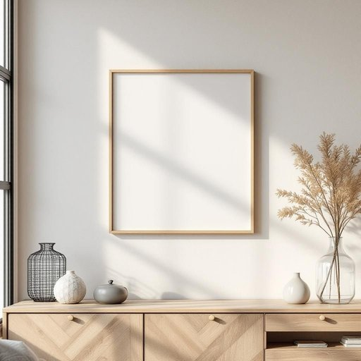

# picture

<h1 style="font-size: 2.5em; font-weight: 300; letter-spacing: 2px; margin: 0; color: #2c3e50;">
/ˈpɪkʧər/
</h1>

---

---

## 例句

The complexity of the machine's design posed a significant challenge to the engineers, who had to analyze every component carefully before proceeding with the assembly.

*The(/ðə/) complexity(/kəmˈplɛksɪti/) of(/əv/) the(/ðə/) machine's(/məˈʃinz/) design(/dɪˈzaɪn/) posed(/poʊzd/) a(/ə/) significant(/sɪgˈnɪfɪkənt/) challenge(/ˈʧælənʤ/) to(/tɪ/) the(/ðə/) engineers,(/ˈɛnʤəˈnɪrz,/) who(/hu/) had(/hæd/) to(/tɪ/) analyze(/ˈænəˌlaɪz/) every(/ˈɛvəri/) component(/kəmˈpoʊnənt/) carefully(/ˈkɛrfəli/) before(/ˌbiˈfɔr/) proceeding(/prəˈsidɪŋ/) with(/wɪθ/) the(/ðə/) assembly.(/əˈsɛmbli./)*

**翻译：** 这台机器设计的复杂性对工程师们构成了重大挑战，他们必须在组装前仔细分析每一个部件。

---

## 解释

在家居生活用品的语境中，英语名词“picture”通常指挂在墙上或摆放在家中作为装饰的“画作”、“照片”或“图片”。具体使用场合多见于描述客厅、卧室或走廊中的装饰品，如“The picture on the wall is a family photo”（墙上的照片是家庭合影），强调视觉美感和空间氛围的营造。英语学习者需注意“picture”作为可数名词时，复数形式为“pictures”，常见搭配包括“a picture frame”（画框）、“a picture on the wall”(墙上的画)、“to hang a picture”（挂画）等，此外，“picture”还可表示整体的“画面”或“影像”，但在家居场景更侧重实物。另外，“picture”可用作动词，表示“想象”或“描绘”，但此含义与家居物品无关。词源上，“picture”源自拉丁语“pictura”，意指绘画艺术，后经法语“picture”进入英语，原指由颜色或线条构成的图像，这也解释了其在家居中作为视觉艺术品的使用。中文语境下，“picture”常准确翻译为“画”、“画作”或“照片”，视具体内容而定，尤其强调其作为室内装饰物的功能，需区别于纯粹的“图画”或“图像”概念。整体而言，“picture”在家居领域是一种中性词汇，不含贬义或褒义，反映的是美学和情感价值，使用时重点在于语境对其具体形态和用途的确定。

---

<small style="color: #999; font-size: 0.9em;">2025-07-27 09:14:04</small>

