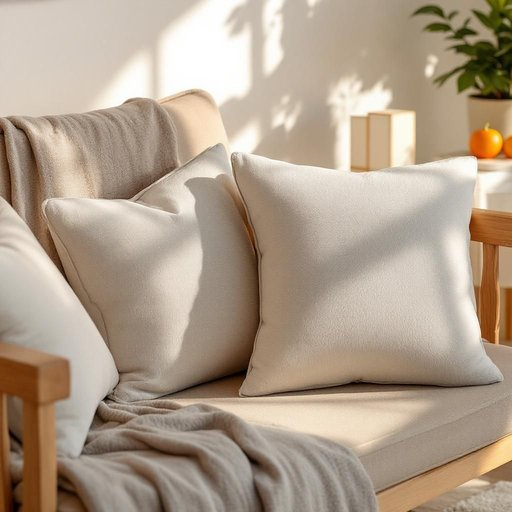

# pillow

<h1 style="font-size: 2.5em; font-weight: 300; letter-spacing: 2px; margin: 0; color: #2c3e50;">
/ˈpɪloʊ/
</h1>

---

---

## 例句

Could you please fluff up the pillow on the sofa before our guests arrive, since the cushions look a bit flat and the living room should feel as welcoming and comfortable as possible?

*Could(/kʊd/) you(/ju/) please(/pliz/) fluff(/fləf/) up(/əp/) the(/ðə/) pillow(/ˈpɪloʊ/) on(/ɔn/) the(/ðə/) sofa(/ˈsoʊfə/) before(/ˌbiˈfɔr/) our(/ɑr/) guests(/gɛsts/) arrive,(/əraɪv,/) since(/sɪns/) the(/ðə/) cushions(/ˈkʊʃənz/) look(/lʊk/) a(/ə/) bit(/bɪt/) flat(/flæt/) and(/ənd/) the(/ðə/) living(/ˈlɪvɪŋ/) room(/rum/) should(/ʃʊd/) feel(/fil/) as(/ɛz/) welcoming(/ˈwɛlkəmɪŋ/) and(/ənd/) comfortable(/ˈkəmfərtəbəl/) as(/ɛz/) possible?(/ˈpɑsəbəl?/)*

**翻译：** 客人到来之前，能否请您将沙发上的枕头拍松一下？因为靠垫看起来有些扁塌，而客厅应该尽量显得温馨舒适。

---

## 解释

英语单词pillow作为名词在家居生活用品场景中指的是供头部、颈部或身体其他部位在休息或睡眠时垫靠的柔软垫子，通常内部填充羽绒、棉花、泡沫或合成材料，外包布制成枕套。具体使用场合多见于卧室、客厅、旅行途中等环境，语境通常涉及睡眠、休息、家具布置或舒适感描述，例如put your head on the pillow（把头放在枕头上）或a decorative pillow（装饰枕）。英语学习者使用时应注意pillow是可数名词，其复数形式为pillows，且常与介词搭配使用，如on the pillow、under the pillow等。另外，pillow可用作动词，表示枕着，但此处重点为名词用法。常见搭配包括pillow case（枕套）、feather pillow（羽毛枕）、throw pillow（装饰靠垫）等。在词源方面，pillow源自古英语pyle或pylea，进一步可追溯至西日耳曼语族，最早与拉丁语pulvinus（枕头）相近，反映了其长久以来作为睡眠用品的历史。中文中pillow准确翻译为枕头，指的即是床上用以支撑头部的用品，避免理解为一般垫子或靠垫时需结合语境区分。该词在中文语境中基本无褒贬色彩，属于中性词汇，但在文化上往往关联着舒适、休息和日常生活习惯，故在文学或口语表达中亦可隐含慰藉和安眠的意味。

---

<small style="color: #999; font-size: 0.9em;">2025-07-27 09:14:04</small>

