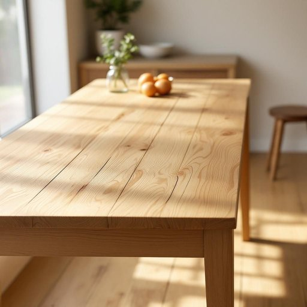

# pine

<h1 style="font-size: 2.5em; font-weight: 300; letter-spacing: 2px; margin: 0; color: #2c3e50;">
/paɪn/
</h1>

---

---

## 例句

The pine dining table, which we inherited from my grandparents and has beautifully aged over the decades with its distinctive grain and warm honey tones, perfectly complements the rustic charm of our kitchen, making it not only a functional piece of furniture but also a cherished family heirloom that brings a sense of history and homeliness to the room.

*The(/ðə/) pine(/paɪn/) dining(/ˈdaɪnɪŋ/) table,(/ˈteɪbəl,/) which(/wɪʧ/) we(/wi/) inherited(/ˌɪnˈhɛrətɪd/) from(/frəm/) my(/maɪ/) grandparents(/ˈgrændˌpɛrənts/) and(/ənd/) has(/həz/) beautifully(/ˈbjutəfli/) aged(/ˈeɪʤɪd/) over(/ˈoʊvər/) the(/ðə/) decades(/ˈdɛkeɪdz/) with(/wɪθ/) its(/ɪts/) distinctive(/dɪˈstɪŋktɪv/) grain(/greɪn/) and(/ənd/) warm(/wɔrm/) honey(/ˈhəni/) tones,(/toʊnz,/) perfectly(/ˈpərfəktli/) complements(/ˈkɑmpləmənts/) the(/ðə/) rustic(/ˈrəstɪk/) charm(/ʧɑrm/) of(/əv/) our(/ɑr/) kitchen,(/ˈkɪʧən,/) making(/ˈmeɪkɪŋ/) it(/ɪt/) not(/nɑt/) only(/ˈoʊnli/) a(/ə/) functional(/ˈfəŋkʃənəl/) piece(/pis/) of(/əv/) furniture(/ˈfərnɪʧər/) but(/bət/) also(/ˈɔlsoʊ/) a(/ə/) cherished(/ˈʧɛrɪʃt/) family(/ˈfæməli/) heirloom(/ˈɛˌrlum/) that(/ðət/) brings(/brɪŋz/) a(/ə/) sense(/sɛns/) of(/əv/) history(/ˈhɪstəri/) and(/ənd/) homeliness(/homeliness*/) to(/tɪ/) the(/ðə/) room.(/rum./)*

**翻译：** 这张松木餐桌是我们从祖父母那里继承下来的，经过数十年的自然风化，其独特的纹理和温润的蜂蜜色调愈发迷人，完美契合了我们厨房的乡村风情。它不仅是一件实用的家具，更是一件珍贵的家族传承，赋予空间历史感与温馨氛围。

---

## 解释

英语单词“pine”作为名词在家居生活用品的语境中，主要指的是“松树”或由松树制成的木材，这种木材因质地较软、色泽浅淡且纹理明晰，常用于制作家具、地板、门窗、橱柜等家居用品。具体使用场合通常包括描述家具材料、装修用材或木质装饰品时，如“一张松木桌子”或“松木地板”。英语学习者在使用“pine”作为名词时应注意其单复数形式“pine”与“pines”及常见搭配，如“pine wood”表示松木，“pine furniture”表示松木家具，同时需区分“pine”作为动词时的另一层含义（“渴望”或“思念”）。词源方面，“pine”源自古英语“pīn”或“pīne”，继承自拉丁语“pinus”，指的是软木针叶树类，历史悠久且与欧洲和北美的松树种类密切相关。在中文语境中，“pine”作为名词通常准确翻译为“松树”或“松木”，强调的是树种或木材属性，无褒贬色彩，属于中性词汇，不过有时在家具描述中“松木”因其较软容易变形，消费者可能会认为其耐用性不及硬木，因此在文化含义上稍带实用性评价，但整体仍属中性描述。

---

<small style="color: #999; font-size: 0.9em;">2025-07-27 09:14:04</small>

