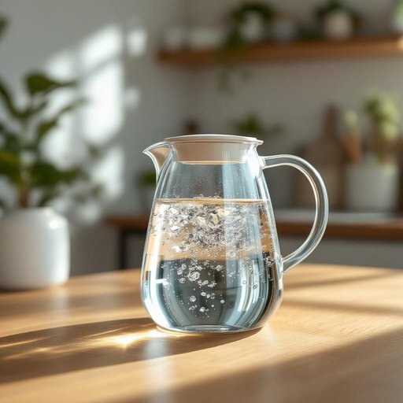

# pitcher

<h1 style="font-size: 2.5em; font-weight: 300; letter-spacing: 2px; margin: 0; color: #2c3e50;">
/ˈpɪʧər/
</h1>

---

---

## 例句

Could you please fill the pitcher on the kitchen table with some fresh water, which I plan to use later for making the herbal tea, since the one in the fridge has been left untouched for a few days and might not be as refreshing?

*Could(/kʊd/) you(/ju/) please(/pliz/) fill(/fɪl/) the(/ðə/) pitcher(/ˈpɪʧər/) on(/ɔn/) the(/ðə/) kitchen(/ˈkɪʧən/) table(/ˈteɪbəl/) with(/wɪθ/) some(/səm/) fresh(/frɛʃ/) water,(/ˈwɔtər,/) which(/wɪʧ/) I(/aɪ/) plan(/plæn/) to(/tɪ/) use(/juz/) later(/ˈleɪtər/) for(/fər/) making(/ˈmeɪkɪŋ/) the(/ðə/) herbal(/ˈərbəl/) tea,(/ti,/) since(/sɪns/) the(/ðə/) one(/wən/) in(/ɪn/) the(/ðə/) fridge(/frɪʤ/) has(/həz/) been(/bɪn/) left(/lɛft/) untouched(/ənˈtəʧt/) for(/fər/) a(/ə/) few(/fju/) days(/deɪz/) and(/ənd/) might(/maɪt/) not(/nɑt/) be(/bi/) as(/ɛz/) refreshing?(/rɪˈfrɛʃɪŋ?/)*

**翻译：** 请您帮忙把厨房桌上的水壶装满新鲜的水，我打算待会用来泡草药茶，因为冰箱里的那壶水已经放了几天，可能不够清新了。

---

## 解释

英语单词“pitcher”在家居生活用品的语境中通常指带有嘴和把手的容器，用来盛装和倒出液体，如水壶、冷饮壶或奶油壶等，常见于厨房、餐桌或野餐场合，使用时多表达“用壶倒水”“壶中装满果汁”等具体动作。学习者应注意“pitcher”作为可数名词，其复数形式为“pitchers”，且通常和量词搭配，如“a glass pitcher”或“two pitchers of water”；在表达倒液体的动作时，可用动词“pour”搭配，如“pour from the pitcher”。此外，“pitcher”在体育领域指投手，语义不同，需根据上下文区分。词源上，“pitcher”源自中古英语“pitcher”，源自古法语“pichier”，意为盛液体的容器，最早与盛水、酒等饮料相关联。在中文语境中，“pitcher”一般译为“水壶”“壶”“冷水壶”等，指带口便于倒水的壶状容器，无褒贬及特殊文化色彩，属于中性词汇，使用时侧重其实用功能及形态特征。总体来说，理解“pitcher”应结合具体生活使用场合及搭配，避免与体育用语混淆，从而准确传达家居生活中的含义。

---

<small style="color: #999; font-size: 0.9em;">2025-07-27 09:14:04</small>

