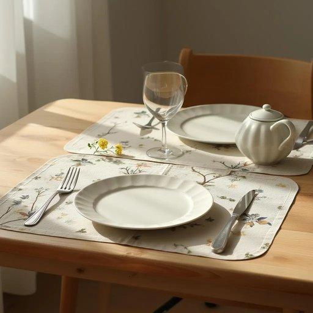

# placemat

<h1 style="font-size: 2.5em; font-weight: 300; letter-spacing: 2px; margin: 0; color: #2c3e50;">
/ˈpleɪsˌmæt/
</h1>

---

---

## 例句

Could you please help me find the placemat that complements the kitchen's colour scheme, featuring a subtle floral pattern and reinforced edges, which I believe Mum purchased last autumn to protect the wooden table from spills during family dinners?

*Could(/kʊd/) you(/ju/) please(/pliz/) help(/hɛlp/) me(/mi/) find(/faɪnd/) the(/ðə/) placemat(/ˈpleɪsˌmæt/) that(/ðət/) complements(/ˈkɑmpləmənts/) the(/ðə/) kitchen's(/ˈkɪʧənz/) colour(/ˈkələr/) scheme,(/skim,/) featuring(/ˈfiʧərɪŋ/) a(/ə/) subtle(/ˈsətəl/) floral(/ˈflɔrəl/) pattern(/ˈpætərn/) and(/ənd/) reinforced(/ˌriɪnˈfɔrst/) edges,(/ˈɛʤɪz,/) which(/wɪʧ/) I(/aɪ/) believe(/bɪˈliv/) Mum(/məm/) purchased(/ˈpərʧəst/) last(/læst/) autumn(/ˈɔtəm/) to(/tɪ/) protect(/prəˈtɛkt/) the(/ðə/) wooden(/ˈwʊdən/) table(/ˈteɪbəl/) from(/frəm/) spills(/spɪlz/) during(/ˈdʊrɪŋ/) family(/ˈfæməli/) dinners?(/ˈdɪnərz?/)*

**翻译：** 您能帮我找到那块与厨房色调相配、带有细腻花卉图案且边缘加固的餐垫吗？我记得妈妈是在去年秋天买的，用来保护木质餐桌，防止家庭聚餐时洒落液体。

---

## 解释

英语单词“placemat”作为名词，指的是放置在餐桌上用来保护桌面、防止餐具弄脏桌子或起装饰作用的小垫子，通常由织物、塑料、纸张或其他防水材料制成，常见于家庭用餐环境、餐厅或宴会等场合。在具体语境中，placemat多用于描述家庭餐厅布置时的细节，例如“Please put the placemats on the table before dinner”（请在晚饭前把餐垫放到桌子上）。英语学习者在使用该词时应注意其为可数名词，复数形式为“placemats”，且其主要功能性和装饰性用途令其多与动词如“lay”，“place”，“set”等搭配，常见短语包括“set the table with placemats”（铺设餐桌垫）或“colorful placemats add charm to the dining room”（色彩鲜艳的餐垫为餐厅增添魅力）。词源方面，“placemat”由“place”（位置、放置）与“mat”（垫子）组成，合成后直接表达“放在特定地方的垫子”的意义，反映其最初的实用功能和位置属性。在中文语境中，“placemat”通常准确翻译为“餐垫”或“餐桌垫”，强调其在餐桌上的保护与装饰作用，没有贬义或特殊色彩，属于中性且生活化的家居用品词汇，常用于描述家庭装修布置和日常生活细节，其文化内涵体现了西方家庭注重就餐卫生和美观的生活习惯。

---

<small style="color: #999; font-size: 0.9em;">2025-07-27 09:14:04</small>

