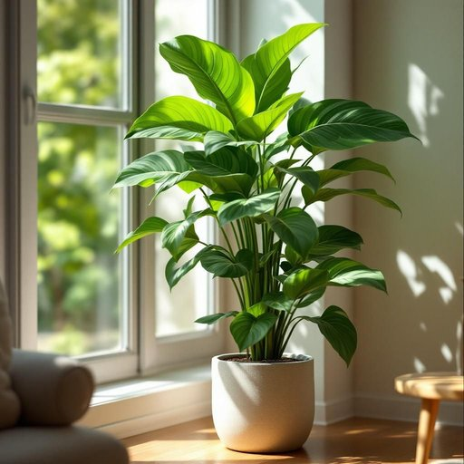

# plant

<h1 style="font-size: 2.5em; font-weight: 300; letter-spacing: 2px; margin: 0; color: #2c3e50;">
/plænt/
</h1>

---

---

## 例句

I decided to place the tall, leafy plant by the window in the living room, where it can receive plenty of natural light and, despite my initial hesitation about watering it frequently, I’ve found that taking care of this particular species has become a surprisingly calming daily ritual.

*I(/aɪ/) decided(/ˌdɪˈsaɪdɪd/) to(/tɪ/) place(/pleɪs/) the(/ðə/) tall,(/tɔl,/) leafy(/ˈlifi/) plant(/plænt/) by(/baɪ/) the(/ðə/) window(/ˈwɪndoʊ/) in(/ɪn/) the(/ðə/) living(/ˈlɪvɪŋ/) room,(/rum,/) where(/wɛr/) it(/ɪt/) can(/kən/) receive(/rɪˈsiv/) plenty(/ˈplɛnti/) of(/əv/) natural(/ˈnæʧərəl/) light(/laɪt/) and,(/ənd,/) despite(/dɪˈspaɪt/) my(/maɪ/) initial(/ˌɪˈnɪʃəl/) hesitation(/ˌhɛzəˈteɪʃən/) about(/əˈbaʊt/) watering(/ˈwɔtərɪŋ/) it(/ɪt/) frequently,(/ˈfrikwɛntli,/) I’ve(/i’ve*/) found(/faʊnd/) that(/ðət/) taking(/ˈteɪkɪŋ/) care(/kɛr/) of(/əv/) this(/ðɪs/) particular(/ˌpɑˈtɪkjələr/) species(/ˈspiʃiz/) has(/həz/) become(/bɪˈkəm/) a(/ə/) surprisingly(/səˈpraɪzɪŋli/) calming(/ˈkɑmɪŋ/) daily(/ˈdeɪli/) ritual.(/ˈrɪʧuəl./)*

**翻译：** 我决定将那株高大繁茂的植物放在客厅的窗边，让它能够充分接受自然光。尽管起初我对频繁浇水心存犹豫，但我发现照料这种植物竟成为了一种意想不到的宁静日常仪式。

---

## 解释

英语单词plant作为名词在家居生活用品的语境中通常指的是“植物”，尤其是室内盆栽或装饰性绿植，用来美化居住环境或改善空气质量，这种用法常见于日常对话或有关家庭布置、园艺护理的话题中，例句如a potted plant（盆栽植物）或house plants（室内植物），英语学习者需要注意的是，plant作为名词时是可数名词，复数形式为plants，此外常见搭配有live plant表示活植物，green plant强调绿色植物，flowering plant指开花植物等，语法上需辨别其与动词plant（种植）的区别，通常名词使用时后面可加定语或形容词修饰，表达更具体的类型和状态，词源上，plant源自拉丁词planta，原意为“幼苗”或“插枝”，逐渐扩展至泛指任何植物，中文语境中，plant在家居用品环境下准确翻译为“植物”或“盆栽植物”，需避免误译为“工厂”或“设施”，这些含义属于该词在工业领域的用法，该词无明显褒贬色彩，通常带有积极、自然、生活美化的文化内涵，反映出绿色环保和提升居家品质的现代生活理念。

---

<small style="color: #999; font-size: 0.9em;">2025-07-27 09:14:04</small>

