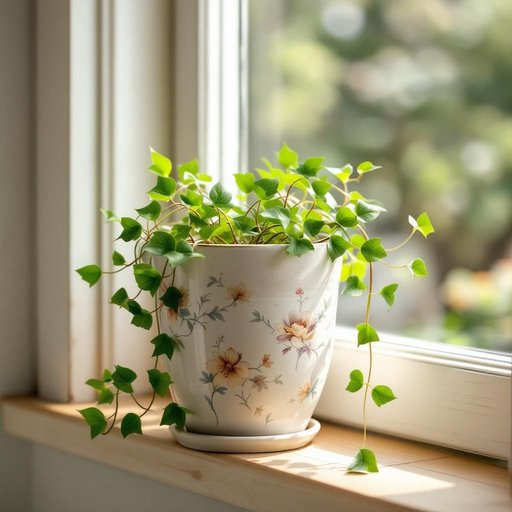

# planter

<h1 style="font-size: 2.5em; font-weight: 300; letter-spacing: 2px; margin: 0; color: #2c3e50;">
/ˈplæntər/
</h1>

---

---

## 例句

I decided to place the antique ceramic planter, which my grandmother had carefully hand-painted with intricate floral designs, on the windowsill where it would catch the morning sunlight and nurture the trailing ivy that I recently bought from the local garden centre.

*I(/aɪ/) decided(/ˌdɪˈsaɪdɪd/) to(/tɪ/) place(/pleɪs/) the(/ðə/) antique(/ænˈtik/) ceramic(/sərˈæmɪk/) planter,(/ˈplæntər,/) which(/wɪʧ/) my(/maɪ/) grandmother(/ˈgrændˌməðər/) had(/hæd/) carefully(/ˈkɛrfəli/) hand-painted(/hand-painted*/) with(/wɪθ/) intricate(/ˈɪntrəkət/) floral(/ˈflɔrəl/) designs,(/dɪˈzaɪnz,/) on(/ɔn/) the(/ðə/) windowsill(/windowsill*/) where(/wɛr/) it(/ɪt/) would(/wʊd/) catch(/kæʧ/) the(/ðə/) morning(/ˈmɔrnɪŋ/) sunlight(/ˈsənˌlaɪt/) and(/ənd/) nurture(/ˈnərʧər/) the(/ðə/) trailing(/ˈtreɪlɪŋ/) ivy(/ˈaɪvi/) that(/ðət/) I(/aɪ/) recently(/ˈrisəntli/) bought(/bɔt/) from(/frəm/) the(/ðə/) local(/ˈloʊkəl/) garden(/ˈgɑrdən/) centre.(/ˈsɛntər./)*

**翻译：** 我决定将那只祖母细心手绘着精致花卉图案的古董陶瓷花盆摆放在窗台上，让它沐浴晨光，以滋养我最近从本地花卉中心购得的攀缘常春藤。

---

## 解释

英语单词“planter”作为名词，在家居生活用品的语境中通常指的是“花盆”或“种植容器”，即用于种植花草或小植物的器皿，这种用法多见于园艺、室内装饰及家居布置场合，例如在描述室内阳台、窗台或客厅的绿色摆设时会提到“planter”。英语学习者在使用时需要注意“planter”作名词时通常是可数名词，可以用复数形式“planters”，且常和植物有关的动词搭配，比如“place a planter on the balcony”（在阳台放一个花盆）、“buy ceramic planters”（买陶瓷花盆）等，此外，“planter”这个词的使用要区分它在不同语境中的含义，比如农业历史中“planter”也可指“大农场主”或“大种植园主”，这一义项带有较强的历史和社会背景色彩，但在家居用品领域无此含义。词源方面，“planter”源自拉丁语“plantare”，意为种植，经过法语传入英语，原意即是“种植者”，引申为“用于种植的器具”。在中文语境中，“planter”最准确的翻译是“花盆”或“种植盆”，强调其作为容器的功能，不同于仅仅指“盆”或“罐”，它特指栽种植物用的器皿。在使用时应避免将其误译为“植物”或“种植者”，以免引起歧义。总体而言，“planter”在家居生活用品语境中是一个中性词，无褒贬色彩，表达简洁明了，适合描述室内外植物的摆设与种植容器。

---

<small style="color: #999; font-size: 0.9em;">2025-07-27 09:14:04</small>

