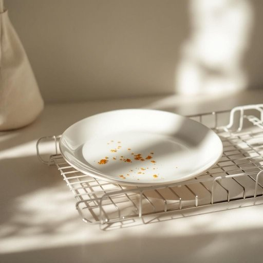

# plate

<h1 style="font-size: 2.5em; font-weight: 300; letter-spacing: 2px; margin: 0; color: #2c3e50;">
/pleɪt/
</h1>

---

---

## 例句

Could you please put the plate that has the remnants of last night's dinner, which Mum specially prepared with that secret recipe, into the dishwasher before you sit down for the film?

*Could(/kʊd/) you(/ju/) please(/pliz/) put(/pʊt/) the(/ðə/) plate(/pleɪt/) that(/ðət/) has(/həz/) the(/ðə/) remnants(/ˈrɛmnənts/) of(/əv/) last(/læst/) night's(/naɪts/) dinner,(/ˈdɪnər,/) which(/wɪʧ/) Mum(/məm/) specially(/ˈspɛʃəli/) prepared(/priˈpɛrd/) with(/wɪθ/) that(/ðət/) secret(/ˈsikrɪt/) recipe,(/ˈrɛsəpi,/) into(/ˈɪntu/) the(/ðə/) dishwasher(/ˈdɪʃˌwɑʃər/) before(/ˌbiˈfɔr/) you(/ju/) sit(/sɪt/) down(/daʊn/) for(/fər/) the(/ðə/) film?(/fɪlm?/)*

**翻译：** 在你坐下看电影之前，能请你把那盘剩着昨晚妈妈用她秘方特别做的晚餐残余的盘子放进洗碗机吗？

---

## 解释

英语单词“plate”在家居生活用品领域作为名词，主要指用于盛放食物的平底圆形餐具，常见于家庭餐桌、餐厅等用餐场合。在具体语境中，如“dinner plate”“salad plate”均指不同大小或用途的盘子，是日常饮食中不可或缺的物品。学习者需注意“plate”作为可数名词，复数形式为“plates”，在表达时常与形容词或限定词搭配，如“a clean plate”“two ceramic plates”，也常与动词搭配，如“set the plates on the table（把盘子摆到桌子上）”。此外，短语如“on a plate”有引申义，表示“轻易得到”的意思，需结合语境区分。词源上，“plate”源自古法语“plate”，意为“平的金属片”，最初指由金属制成的薄板，后引申到陶瓷或玻璃制的盘子，体现了物品形态的演变。在中文语境中，“plate”一般准确翻译为“盘子”，对应日常生活中的餐盘，需避免与“碟子（saucer）”混淆，以保证用词准确。总体来看，“plate”作为家居生活用品名词含义中立，没有特殊褒贬色彩，但在文化层面代表了西方饮食文化中的基本餐具，与中国餐具体系如碗、筷子不同，反映了用餐习惯的差异。

---

<small style="color: #999; font-size: 0.9em;">2025-07-27 09:14:04</small>

