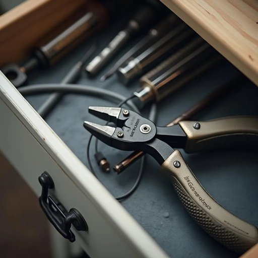

# plier

<h1 style="font-size: 2.5em; font-weight: 300; letter-spacing: 2px; margin: 0; color: #2c3e50;">
/plaɪər/
</h1>

---

---

## 例句

If you could pass me the plier that’s usually kept in the second drawer beside the screwdriver set, I need to carefully twist this stubborn wire while making sure not to damage the delicate insulation, otherwise, the whole circuit might short-circuit and cause a bigger problem later on.

*If(/ɪf/) you(/ju/) could(/kʊd/) pass(/pæs/) me(/mi/) the(/ðə/) plier(/plaɪər/) that’s(/that’s*/) usually(/ˈjuʒəwəli/) kept(/kɛpt/) in(/ɪn/) the(/ðə/) second(/ˈsɛkənd/) drawer(/drɔr/) beside(/ˌbiˈsaɪd/) the(/ðə/) screwdriver(/ˈskruˌdraɪvər/) set,(/sɛt,/) I(/aɪ/) need(/nid/) to(/tɪ/) carefully(/ˈkɛrfəli/) twist(/twɪst/) this(/ðɪs/) stubborn(/ˈstəbərn/) wire(/waɪər/) while(/waɪl/) making(/ˈmeɪkɪŋ/) sure(/ʃʊr/) not(/nɑt/) to(/tɪ/) damage(/ˈdæmɪʤ/) the(/ðə/) delicate(/ˈdɛləkət/) insulation,(/ˌɪnsəˈleɪʃən,/) otherwise,(/ˈəðərˌwaɪz,/) the(/ðə/) whole(/hoʊl/) circuit(/ˈsərkət/) might(/maɪt/) short-circuit(/short-circuit*/) and(/ənd/) cause(/kɔz/) a(/ə/) bigger(/ˈbɪgər/) problem(/ˈprɑbləm/) later(/ˈleɪtər/) on.(/ɔn./)*

**翻译：** 如果你能把通常放在螺丝刀套装旁边第二个抽屉里的钳子递给我就好了，我需要小心地扭动这根倔强的电线，同时确保不损坏那层脆弱的绝缘层，否则整个电路可能会短路，进而引发更大的问题。

---

## 解释

英语单词“plier”作为名词在家居生活用品语境中指的是一种手工工具，即“钳子”，用来夹持、弯曲或剪切物体，常见于修理、组装、手工制作等场合，典型例子如尖嘴钳（needle-nose pliers）或水泵钳（water pump pliers）。学习者使用该词时应注意其通常为复数形式“pliers”，单数形式“plier”较少见且不太常用，文中多以复数表达这一工具类别，同时“plier”作为可数名词时一般指一种具体的钳子；常见搭配有“一把钳子”（a pair of pliers），此表达固定，需注意与单数工具名词区别。词源上，“plier”源自古法语动词“plier”，意为“弯曲”，反映了该工具的功能属性。中文语境中，“plier”准确翻译为“钳子”，需避免误译为“夹子”等其他相近工具，以免造成混淆。该词无特殊的褒贬色彩或文化内涵，属于中性且广泛使用的工具名词，提及时重点强调其机械辅助功能，方便家居生活中的具体操作。

---

<small style="color: #999; font-size: 0.9em;">2025-07-27 09:14:04</small>

