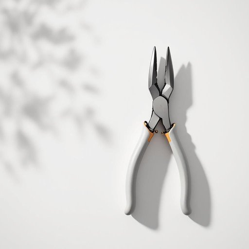

# pliers

<h1 style="font-size: 2.5em; font-weight: 300; letter-spacing: 2px; margin: 0; color: #2c3e50;">
/plaɪərz/
</h1>

---

---

## 例句

Before you start rewiring the old lamp, make sure you have a good pair of pliers, because they’re essential for gripping the wires firmly and cutting through any stubborn insulation without damaging the delicate copper inside.

*Before(/ˌbiˈfɔr/) you(/ju/) start(/stɑrt/) rewiring(/riˈwaɪərɪŋ/) the(/ðə/) old(/oʊld/) lamp,(/læmp,/) make(/meɪk/) sure(/ʃʊr/) you(/ju/) have(/hæv/) a(/ə/) good(/gʊd/) pair(/pɛr/) of(/əv/) pliers,(/plaɪərz,/) because(/bɪˈkəz/) they’re(/they’re*/) essential(/ɛˈsɛnʃəl/) for(/fər/) gripping(/ˈgrɪpɪŋ/) the(/ðə/) wires(/waɪərz/) firmly(/ˈfərmli/) and(/ənd/) cutting(/ˈkətɪŋ/) through(/θru/) any(/ˈɛni/) stubborn(/ˈstəbərn/) insulation(/ˌɪnsəˈleɪʃən/) without(/wɪˈθaʊt/) damaging(/ˈdæmɪʤɪŋ/) the(/ðə/) delicate(/ˈdɛləkət/) copper(/ˈkɑpər/) inside.(/ˌɪnˈsaɪd./)*

**翻译：** 在开始给旧灯重新布线之前，务必准备一把质量上乘的钳子，因为它对于牢牢抓住电线以及切断顽固绝缘层而不损伤内部细致的铜线至关重要。

---

## 解释

英语单词“pliers”作为名词，指的是一种常见的手工具，通常用于夹持、扭转、剪断或弯曲物体，广泛应用于家居维修、电工作业及手工制作等场合。此词在具体使用时多出现在描述工具箱内容、修理指南或家居日常使用情境中，表达的是一把带有两个柄和钳口的工具，形态固定，通常以复数形式出现，因为英语中“pliers”本身即为复数形式，单数用法较少，使用时需注意其固定的复数结构，谓语动词也应采用复数形式，如“the pliers are on the table”。常见搭配有“needle-nose pliers”（尖嘴钳）、“wire cutters”或“locking pliers”等，表达技巧上可以根据功能细分不同种类的钳子以提升表达准确度。词源上，“pliers”源自中世纪法语“plier”意为“折叠”，反映该工具通过两个柄折叠抓取物体的功能特性。中文翻译多为“钳子”或“钳”，在家居生活用品语境中理解为一种用力夹取或固定的工具，作用类似于汉语中常见的“尖嘴钳”、“老虎钳”等。该词无明显褒贬或文化色彩，属于中性工具名词，使用时只需注意其复数形式和与动词的一致性即可。

---

<small style="color: #999; font-size: 0.9em;">2025-07-27 09:14:04</small>

