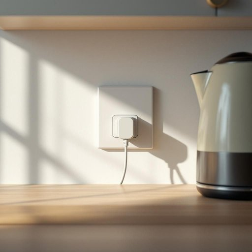

# plug

<h1 style="font-size: 2.5em; font-weight: 300; letter-spacing: 2px; margin: 0; color: #2c3e50;">
/pləg/
</h1>

---

---

## 例句

Could you please check if the plug for the kettle is properly inserted into the socket behind the cupboard, because last night, after I finished making tea and switched everything off, I noticed that the plug wasn’t fully secured and might have been the reason why the kitchen light flickered intermittently?

*Could(/kʊd/) you(/ju/) please(/pliz/) check(/ʧɛk/) if(/ɪf/) the(/ðə/) plug(/pləg/) for(/fər/) the(/ðə/) kettle(/ˈkɛtəl/) is(/ɪz/) properly(/ˈprɑpərli/) inserted(/ˌɪnˈsərtɪd/) into(/ˈɪntu/) the(/ðə/) socket(/ˈsɑkət/) behind(/bɪˈhaɪnd/) the(/ðə/) cupboard,(/ˈkəbərd,/) because(/bɪˈkəz/) last(/læst/) night,(/naɪt,/) after(/ˈæftər/) I(/aɪ/) finished(/ˈfɪnɪʃt/) making(/ˈmeɪkɪŋ/) tea(/ti/) and(/ənd/) switched(/swɪʧt/) everything(/ˈɛvriˌθɪŋ/) off,(/ɔf,/) I(/aɪ/) noticed(/ˈnoʊtɪst/) that(/ðət/) the(/ðə/) plug(/pləg/) wasn’t(/wasn’t*/) fully(/ˈfʊli/) secured(/sɪˈkjʊrd/) and(/ənd/) might(/maɪt/) have(/hæv/) been(/bɪn/) the(/ðə/) reason(/ˈrizən/) why(/waɪ/) the(/ðə/) kitchen(/ˈkɪʧən/) light(/laɪt/) flickered(/ˈflɪkərd/) intermittently?(/ˌɪntərˈmɪtəntli?/)*

**翻译：** 请您帮忙确认一下茶壶的插头是否已正确插入橱柜后面的插座？因为昨晚我泡完茶并关闭所有电源后，发现插头没有完全插紧，可能是厨房灯光时断时续的原因。

---

## 解释

plug作为名词在家居生活用品场景中，主要指插头，即电器或电线末端插入插座以连接电源的装置。这种用法常见于描述电器连接电源的情境，如electric plug（电插头）、power plug（电源插头）等。英语学习者在使用时需注意，plug作为名词通常与电器或电源相关，且作复数时变为plugs。常见搭配包括insert the plug into the socket（将插头插入插座）、pull out the plug（拔出插头）等表达，体现动作的具体性及安全操作。词源上，plug源自中古英语，原意是堵塞孔洞的塞子，后来引申为各种闭合或连接装置，电气插头这一义项源于此形象，即塞入接口的部件。在中文语境中，plug准确翻译为插头，明确指代电器连接部分，无褒贬色彩，属于中性词汇。需要注意的是，英语中有时plug也可指广告宣传等引申义，但在家居生活用品场景中，仅作为电插头理解最为准确和常用。

---

<small style="color: #999; font-size: 0.9em;">2025-07-27 09:14:04</small>

