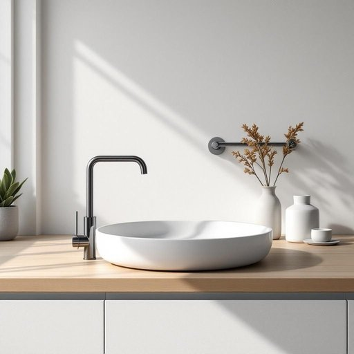

# plumbing

<h1 style="font-size: 2.5em; font-weight: 300; letter-spacing: 2px; margin: 0; color: #2c3e50;">
/ˈpləmɪŋ/
</h1>

---

---

## 例句

Before we proceed with redecorating the kitchen, I think it’s crucial that we have a professional inspect the plumbing, particularly because the old pipes, which have been causing intermittent leaks behind the sink and inconsistent water pressure in the taps, might need replacing to prevent any future damage.

*Before(/ˌbiˈfɔr/) we(/wi/) proceed(/pərˈsid/) with(/wɪθ/) redecorating(/riˈdɛkərˌeɪtɪŋ/) the(/ðə/) kitchen,(/ˈkɪʧən,/) I(/aɪ/) think(/θɪŋk/) it’s(/it’s*/) crucial(/ˈkruʃəl/) that(/ðət/) we(/wi/) have(/hæv/) a(/ə/) professional(/prəˈfɛʃənəl/) inspect(/ˌɪnˈspɛkt/) the(/ðə/) plumbing,(/ˈpləmɪŋ,/) particularly(/ˌpɑrˈtɪkjələrli/) because(/bɪˈkəz/) the(/ðə/) old(/oʊld/) pipes,(/paɪps,/) which(/wɪʧ/) have(/hæv/) been(/bɪn/) causing(/ˈkɔzɪŋ/) intermittent(/ˌɪntərˈmɪtənt/) leaks(/liks/) behind(/bɪˈhaɪnd/) the(/ðə/) sink(/sɪŋk/) and(/ənd/) inconsistent(/ˌɪnkənˈsɪstənt/) water(/ˈwɔtər/) pressure(/ˈprɛʃər/) in(/ɪn/) the(/ðə/) taps,(/tæps,/) might(/maɪt/) need(/nid/) replacing(/rɪˈpleɪsɪŋ/) to(/tɪ/) prevent(/prɪˈvɛnt/) any(/ˈɛni/) future(/fˈjuʧər/) damage.(/ˈdæmɪʤ./)*

**翻译：** 在我们着手重新装修厨房之前，我认为有必要请专业人员检查一下管道，特别是鉴于旧管道在水槽后方时有间歇性漏水且水龙头水压不稳，可能需要更换，以防止将来发生任何损害。

---

## 解释

英语单词“plumbing”作为名词，在家居生活用品场景中主要指房屋或建筑内部的供水系统和排水系统，包括自来水管道、下水管道、阀门、水龙头、排水口等装置，通常用于描述水的输送和排放设施。具体使用场合多见于装修、维修或维护房屋水暖系统时，比如“the plumbing needs repair”（水暖系统需要修理）或“a licensed plumber specializes in plumbing”（有执照的水暖工专门从事水暖工作）。学习者在使用时需注意“plumbing”作为不可数名词，通常不加复数形式，且多与动词如“fix”“repair”“install”连用，常见搭配还包括“plumbing system”（水暖系统）“plumbing fixtures”（卫生设备如水槽、马桶等）等。语法上，“plumbing”常用作主语、宾语或表语。词源上，“plumbing”源自拉丁语“plumbum”，意为“铅”，因为古代水管多用铅制成，后引申为整个水管系统。中文语境中，“plumbing”准确翻译为“水暖系统”或“给排水系统”，侧重于技术设施层面，不直接指单个器具或设备。该词本身无明显褒贬色彩或特殊文化内涵，属于中性词，通常用于专业或日常生活中描述家居水暖相关内容，体现的是技术和功能方面的意义。

---

<small style="color: #999; font-size: 0.9em;">2025-07-27 09:14:04</small>

