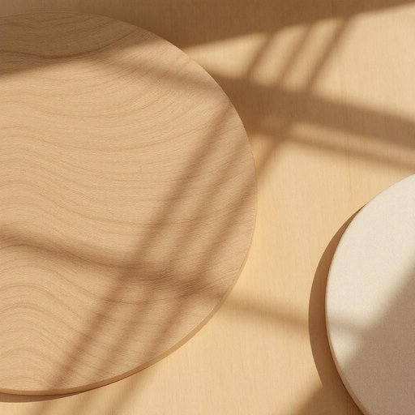

# polish

<h1 style="font-size: 2.5em; font-weight: 300; letter-spacing: 2px; margin: 0; color: #2c3e50;">
/ˈpɑlɪʃ/
</h1>

---

---

## 例句

Before you start dusting the shelves, make sure to use the polish that’s specifically designed for wooden surfaces, which not only enhances the natural grain but also provides a protective layer against future scratches and moisture.

*Before(/ˌbiˈfɔr/) you(/ju/) start(/stɑrt/) dusting(/ˈdəstɪŋ/) the(/ðə/) shelves,(/ʃɛlvz,/) make(/meɪk/) sure(/ʃʊr/) to(/tɪ/) use(/juz/) the(/ðə/) polish(/ˈpɑlɪʃ/) that’s(/that’s*/) specifically(/spəˈsɪfɪkli/) designed(/dɪˈzaɪnd/) for(/fər/) wooden(/ˈwʊdən/) surfaces,(/ˈsərfəsɪz,/) which(/wɪʧ/) not(/nɑt/) only(/ˈoʊnli/) enhances(/ɛnˈhænsɪz/) the(/ðə/) natural(/ˈnæʧərəl/) grain(/greɪn/) but(/bət/) also(/ˈɔlsoʊ/) provides(/prəˈvaɪdz/) a(/ə/) protective(/prəˈtɛktɪv/) layer(/leɪər/) against(/əˈgɛnst/) future(/fˈjuʧər/) scratches(/ˈskræʧɪz/) and(/ənd/) moisture.(/ˈmɔɪsʧər./)*

**翻译：** 在开始为书架除尘之前，请务必使用专为木质表面设计的抛光剂，这不仅能够突出木纹的自然美感，还能形成保护层，防止未来划痕和湿气侵害。

---

## 解释

英语单词“polish”作为名词，在家居生活用品的语境中通常指用于擦亮、保养家具、地板、鞋子等表面的抛光剂或护理剂，具体使用场合多为家庭清洁、家具维护或鞋类护理时，例如wood polish（木器光亮剂）、shoe polish（鞋油）、floor polish（地板蜡）。英语学习者需要注意“polish”作为名词时是不可数名词或可数名词，具体用法依上下文而定，如“a polish”指一瓶抛光剂，而泛指时用“polish”不加冠词；常见搭配有“apply polish”、“use polish”、“a can of polish”等，表达时应注意区分“polish”（n. 抛光剂）和“polish”（v. 擦亮、改进），搭配时谓语动词要对应名词或动词的用法。词源方面，“polish”来源于中世纪拉丁语“polire”，意为“打磨、擦亮”，随后进入古法语及中世纪英语，体现了通过摩擦使物品表面光亮的含义。在中文语境中，“polish”作为名词应准确翻译为“抛光剂”或“擦亮剂”，反映其物质属性和用途，避免误解为动词意义的“磨光”或“改进”。这个词本身没有褒贬色彩，属于中性词，文化内涵主要体现在日常家庭护理生活的实用性和维护物品美观上的重要角色。

---

<small style="color: #999; font-size: 0.9em;">2025-07-27 09:14:04</small>

