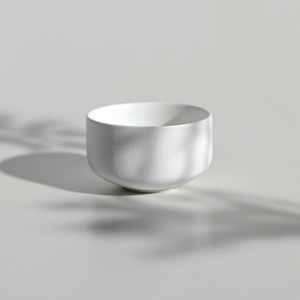

# porcelain

<h1 style="font-size: 2.5em; font-weight: 300; letter-spacing: 2px; margin: 0; color: #2c3e50;">
/ˈpɔrsələn/
</h1>

---

---

## 例句

The complexity of the project demanded not only technical expertise but also a deep understanding of the underlying principles to ensure successful implementation.

*The(/ðə/) complexity(/kəmˈplɛksɪti/) of(/əv/) the(/ðə/) project(/ˈprɑʤɛkt/) demanded(/dɪˈmændɪd/) not(/nɑt/) only(/ˈoʊnli/) technical(/ˈtɛknɪkəl/) expertise(/ˌɛkspərˈtiz/) but(/bət/) also(/ˈɔlsoʊ/) a(/ə/) deep(/dip/) understanding(/ˌəndərˈstændɪŋ/) of(/əv/) the(/ðə/) underlying(/ˌəndərˈlaɪɪŋ/) principles(/ˈprɪnsəpəlz/) to(/tɪ/) ensure(/ɪnˈʃʊr/) successful(/səkˈsɛsfəl/) implementation.(/ˌɪmpləmɛnˈteɪʃən./)*

**翻译：** 该项目的复杂性不仅要求具备技术专长，还需对其基本原理有深入理解，方能确保成功实施。

---

## 解释

英语单词“porcelain”作为名词，在家居生活用品的语境中主要指一种质地细腻、色泽洁白、硬度较高的瓷器材料，通常用于制作餐具、茶杯、花瓶等精致的日常用品或装饰品。具体使用场合多见于描述餐厅、厨房、陈设环境或购物时谈及瓷器制品的品质和类型，例如“porcelain dishes”（瓷器餐具）或“porcelain vases”（瓷花瓶）。英语学习者在使用该词时应注意，“porcelain”通常作为不可数名词出现，表示材料整体，而当指单件物品时亦可视具体语境加冠词，如“一件瓷器”；此外，常见搭配还有“porcelain ware”（瓷器制品）、“fine porcelain”（精美瓷器）等，用于表达瓷器的品质和用途。在语法上，该词通常不作复数形式出现，且搭配时多用复合名词结构。其词源源自中古英语，借用法语“porcelaine”，更早可追溯至意大利语“porcellana”，原意指“珍珠贝壳”，因瓷器表面光滑如贝壳而得名。中文语境中，“porcelain”最准确的对应词是“瓷器”，强调其质地坚硬、外观光洁、工艺精细的特点，无明显褒贬含义，但因瓷器在中华文化中象征精致与优雅，使用时常带有正面文化内涵，代表高品质和艺术价值。总的来说，“porcelain”作为家居生活用品名词时，既是一种具体的材质名称，也隐含了文化和审美层面的认知，应结合具体语境准确理解和使用。

---

<small style="color: #999; font-size: 0.9em;">2025-07-27 09:14:04</small>

