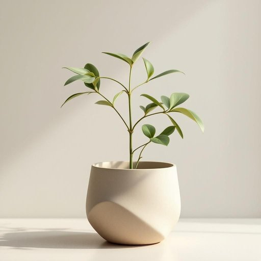

# pot

<h1 style="font-size: 2.5em; font-weight: 300; letter-spacing: 2px; margin: 0; color: #2c3e50;">
/pɑt/
</h1>

---

---

## 例句

The reporter questioned the validity of the claim, emphasizing that the word itself held multiple meanings depending on the context in which it was used.

*The(/ðə/) reporter(/rɪˈpɔrtər/) questioned(/kˈwɛsʧənd/) the(/ðə/) validity(/vəˈlɪdɪti/) of(/əv/) the(/ðə/) claim,(/kleɪm,/) emphasizing(/ˈɛmfəˌsaɪzɪŋ/) that(/ðət/) the(/ðə/) word(/wərd/) itself(/ˌɪtˈsɛlf/) held(/hɛld/) multiple(/ˈməltəpəl/) meanings(/ˈminɪŋz/) depending(/dɪˈpɛndɪŋ/) on(/ɔn/) the(/ðə/) context(/ˈkɑntɛkst/) in(/ɪn/) which(/wɪʧ/) it(/ɪt/) was(/wɑz/) used.(/juzd./)*

**翻译：** 记者质疑了该说法的有效性，强调该词本身根据使用的语境具有多重含义。

---

## 解释

英语单词“pot”作为名词在家居生活用品语境中通常指盛水、烧煮或种植植物的器皿，具体使用场合包括厨房中用来煮汤、炖菜的锅具（如煮锅），以及用于养花的花盆等，语境一般围绕烹饪和园艺活动展开。学习者注意“pot”作为可数名词时需与适当的冠词连用（a pot, the pot），且可与形容词搭配形成常见表达，如“a cooking pot”（炖锅）、“a flower pot”（花盆）、“a tea pot”（茶壶，注意teapot为复合词）等，此外，动词形式“pot”则有种植、装罐之意。词源上，“pot”源自中古英语“potte”，进一步源自拉丁语“pottus”，与欧陆多种语言中的陶器词根相关，反映了其作为容器的基本属性。在中文语境中，“pot”根据具体用途准确译为“锅”、“罐”、“盆”等，如厨房用的“锅”更贴切，而用于种花的则是“花盆”；需根据语境区别，避免泛化。“pot”本身无明显褒贬色彩，但在某些俚语或隐喻中另有含义，需谨慎使用，家居生活用品语境中一般无特殊文化内涵，属中性词汇。

---

<small style="color: #999; font-size: 0.9em;">2025-07-27 09:14:04</small>

