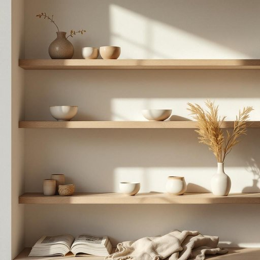

# pottery

<h1 style="font-size: 2.5em; font-weight: 300; letter-spacing: 2px; margin: 0; color: #2c3e50;">
/ˈpɑtəri/
</h1>

---

---

## 例句

I carefully arranged the delicate pottery, which included hand-painted bowls and vases that my grandmother collected over the years, on the open shelves in the living room to add a touch of rustic charm and personal history to our otherwise modern home.

*I(/aɪ/) carefully(/ˈkɛrfəli/) arranged(/əreɪnʤd/) the(/ðə/) delicate(/ˈdɛləkət/) pottery,(/ˈpɑtəri,/) which(/wɪʧ/) included(/ˌɪnˈkludɪd/) hand-painted(/hand-painted*/) bowls(/boʊlz/) and(/ənd/) vases(/ˈvɑzɪz/) that(/ðət/) my(/maɪ/) grandmother(/ˈgrændˌməðər/) collected(/kəˈlɛktəd/) over(/ˈoʊvər/) the(/ðə/) years,(/jɪrz,/) on(/ɔn/) the(/ðə/) open(/ˈoʊpən/) shelves(/ʃɛlvz/) in(/ɪn/) the(/ðə/) living(/ˈlɪvɪŋ/) room(/rum/) to(/tɪ/) add(/æd/) a(/ə/) touch(/təʧ/) of(/əv/) rustic(/ˈrəstɪk/) charm(/ʧɑrm/) and(/ənd/) personal(/ˈpərsɪnəl/) history(/ˈhɪstəri/) to(/tɪ/) our(/ɑr/) otherwise(/ˈəðərˌwaɪz/) modern(/ˈmɑdərn/) home.(/hoʊm./)*

**翻译：** 我小心地将那些精致的陶器，包括祖母多年收藏的手绘碗和花瓶，摆放在客厅的开放式搁架上，为我们这座本就现代的家增添了一抹乡村韵味和个人历史的气息。

---

## 解释

英语单词“pottery”作为名词在家居生活用品的语境中，通常指用陶土制成的器皿或制品，如花瓶、碗、盘、罐等，既包括日常实用的陶器，也涵盖具有装饰性的陶艺作品。这一词常用于描述家庭装修、厨房用品或艺术收藏相关的话题，例句如“The pottery on the shelf is handmade”（架子上的陶器是手工制作的）。学习者使用时应注意，“pottery”作为不可数名词时表示陶器整体或陶艺行业，而作为可数名词时较少使用，通常用复数形式“potteries”指多件陶器产品。常见搭配有“pottery shop”（陶器店）、“pottery class”（陶艺课）、“clay pottery”（陶土陶器）等。此外，“pottery”在语法上不可直接用作复数形式出现多数具体陶器对象时，常用“pieces of pottery”或“pottery items”。该词源自古法语“potterie”，追溯至拉丁词根“pottarium”，意指制作锅罐的手工艺，反映了陶器手工制作的工艺背景。在中文中，“pottery”对应的准确翻译为“陶器”或“陶艺品”，重点强调其材质和制作工艺，常见于家庭装饰及实用器皿的描述中。此词本身无褒贬含义，文化上与中华陶瓷艺术相似，具有一定的艺术和手工艺色彩，体现了传统工艺的价值和生活中的实用美学。

---

<small style="color: #999; font-size: 0.9em;">2025-07-27 09:14:04</small>

