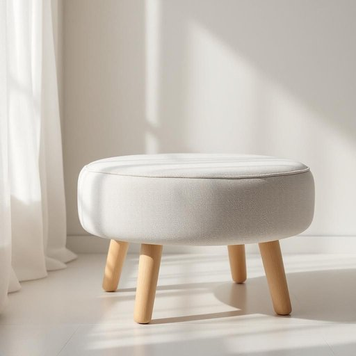

# pouffe

<h1 style="font-size: 2.5em; font-weight: 300; letter-spacing: 2px; margin: 0; color: #2c3e50;">
/pouffe*/
</h1>

---

---

## 例句

The thought of embarking on a challenging journey filled with uncertainties compelled him to reconsider his initial plans and seek advice from those with more experience.

*The(/ðə/) thought(/θɔt/) of(/əv/) embarking(/ɛmˈbɑrkɪŋ/) on(/ɔn/) a(/ə/) challenging(/ˈʧælənʤɪŋ/) journey(/ˈʤərni/) filled(/fɪld/) with(/wɪθ/) uncertainties(/ənˈsərtəntiz/) compelled(/kəmˈpɛld/) him(/ɪm/) to(/tɪ/) reconsider(/ˌrikənˈsɪdər/) his(/hɪz/) initial(/ˌɪˈnɪʃəl/) plans(/plænz/) and(/ənd/) seek(/sik/) advice(/ədˈvaɪs/) from(/frəm/) those(/ðoʊz/) with(/wɪθ/) more(/mɔr/) experience.(/ɪkˈspɪriəns./)*

**翻译：** 踏上充满未知和挑战的旅程的念头促使他重新审视最初的计划，并向那些经验丰富的人士寻求建议。

---

## 解释

英语单词“pouffe”在家居生活用品语境中作为名词，指的是一种矮而软的脚凳或坐垫，通常是圆形或方形，内部填充柔软材料，用于客厅或卧室中作为休闲时的脚踏板或额外座椅。具体使用场合多见于家庭起居空间、休闲区或装饰性家具中，常用来提升坐感舒适度或作为装饰元素。英语学习者在使用“pouffe”时应注意其作为可数名词的语法特征，单数形式为pouffe，复数形式通常为pouffes。常见的搭配有“a leather pouffe”（一个皮制脚凳）、“a pouffe ottoman”（一种结合了传统脚凳和储物功能的pouffe）等，表达时也可用颜色、材质、功能等形容词修饰以丰富语义。该词源自法语“pouffé”，与“puff”（蓬松物）有语义关联，暗示其柔软蓬松的特性，18世纪开始引入英语家居词汇。中文中“pouffe”通常准确译为“脚凳”或“软脚凳”，部分语境也可称为“矮凳”或“布艺坐垫”，强调其柔软和矮小的特点。此词本身无褒贬色彩，属于中性家居用语，但在某些文化背景中，作为舒适和休闲生活方式的象征，可能带有轻松、优雅的生活氛围内涵。

---

<small style="color: #999; font-size: 0.9em;">2025-07-27 09:14:04</small>

