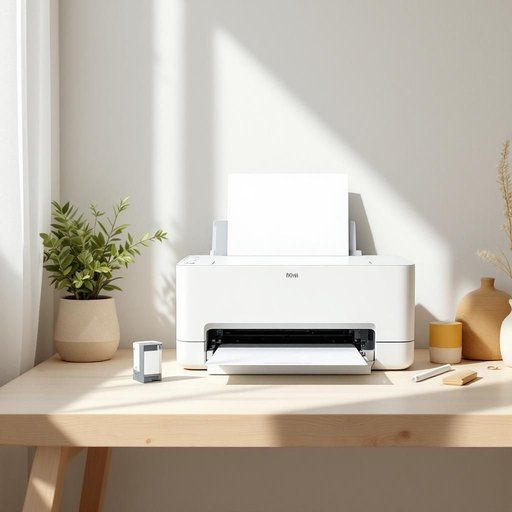

# printer

<h1 style="font-size: 2.5em; font-weight: 300; letter-spacing: 2px; margin: 0; color: #2c3e50;">
/ˈprɪnər/
</h1>

---

---

## 例句

I was about to print out the boarding passes for our trip when I realized the printer, which usually works flawlessly despite its age, had run out of ink and was refusing to respond to any commands from my laptop.

*I(/aɪ/) was(/wɑz/) about(/əˈbaʊt/) to(/tɪ/) print(/prɪnt/) out(/aʊt/) the(/ðə/) boarding(/ˈbɔrdɪŋ/) passes(/ˈpæsɪz/) for(/fər/) our(/ɑr/) trip(/trɪp/) when(/wɪn/) I(/aɪ/) realized(/ˈriəˌlaɪzd/) the(/ðə/) printer,(/ˈprɪnər,/) which(/wɪʧ/) usually(/ˈjuʒəwəli/) works(/wərks/) flawlessly(/ˈflɔləsli/) despite(/dɪˈspaɪt/) its(/ɪts/) age,(/eɪʤ,/) had(/hæd/) run(/rən/) out(/aʊt/) of(/əv/) ink(/ɪŋk/) and(/ənd/) was(/wɑz/) refusing(/rɪfˈjuzɪŋ/) to(/tɪ/) respond(/rɪˈspɑnd/) to(/tɪ/) any(/ˈɛni/) commands(/kəˈmændz/) from(/frəm/) my(/maɪ/) laptop.(/ˈlæpˌtɑp./)*

**翻译：** 我正准备打印我们旅行的登机牌时，才发现这台尽管年久却一向运作无碍的打印机已经没墨了，而且无论我怎样操作，笔记本电脑发出的指令都无法使它响应。

---

## 解释

英语单词"printer"在家居生活用品的语境中作为名词，主要指的是能将电子文档、图片等内容通过机械或电子方式打印到纸张上的设备，常见于家庭办公室或个人使用场合，如打印作业、照片、文件等。英语学习者在使用"printer"时需注意其作为可数名词，通常单复数形式分别是"printer"和"printers"；常见搭配包括"inkjet printer"（喷墨打印机）、"laser printer"（激光打印机）、"printer cartridge"（打印机墨盒）等，要注意与相关动词搭配时常用"print"（打印）、"connect a printer"（连接打印机）等表达。词源上，"printer"源自拉丁语"premere"（压、按），通过拉丁语及古法语演变成英语中的"print"，"printer"即执行打印动作的人或机器。中文语境中，"printer"准确翻译为“打印机”，强调其作为电子设备的功能，没有贬义或特殊文化色彩，是现代家居及办公环境中常见且重要的工具，理解时应避免将其与“印刷工人”混淆，在家居用品类别更多指机械设备而非职业身份。

---

<small style="color: #999; font-size: 0.9em;">2025-07-27 09:14:04</small>

