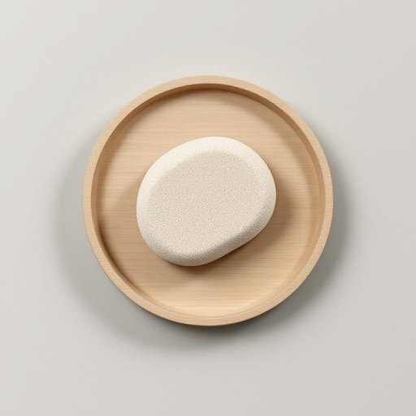

# pumice

<h1 style="font-size: 2.5em; font-weight: 300; letter-spacing: 2px; margin: 0; color: #2c3e50;">
/ˈpəməs/
</h1>

---

---

## 例句

Before scrubbing the stubborn stains off the bathtub, I grabbed the pumice stone from under the sink, knowing that its abrasive texture, which is perfect for gently removing grime without scratching the surface, would make the task much easier and save me from using harsh chemicals.

*Before(/ˌbiˈfɔr/) scrubbing(/ˈskrəbɪŋ/) the(/ðə/) stubborn(/ˈstəbərn/) stains(/steɪnz/) off(/ɔf/) the(/ðə/) bathtub,(/ˈbæθtəb,/) I(/aɪ/) grabbed(/græbd/) the(/ðə/) pumice(/ˈpəməs/) stone(/stoʊn/) from(/frəm/) under(/ˈəndər/) the(/ðə/) sink,(/sɪŋk,/) knowing(/noʊɪŋ/) that(/ðət/) its(/ɪts/) abrasive(/əˈbreɪsɪv/) texture,(/ˈtɛksʧər,/) which(/wɪʧ/) is(/ɪz/) perfect(/ˈpərˌfɪkt/) for(/fər/) gently(/ˈʤɛntli/) removing(/riˈmuvɪŋ/) grime(/graɪm/) without(/wɪˈθaʊt/) scratching(/ˈskræʧɪŋ/) the(/ðə/) surface,(/ˈsərfəs,/) would(/wʊd/) make(/meɪk/) the(/ðə/) task(/tæsk/) much(/məʧ/) easier(/ˈiziər/) and(/ənd/) save(/seɪv/) me(/mi/) from(/frəm/) using(/ˈjuzɪŋ/) harsh(/hɑrʃ/) chemicals.(/ˈkɛmɪkəlz./)*

**翻译：** 在擦洗浴缸上的顽固污渍之前，我从水槽下拿起了浮石，知道它那适合轻柔去除污垢而不刮伤表面的粗糙质地，会让这项任务轻松许多，也免去了我使用刺激性化学品的烦恼。

---

## 解释

英语单词“pumice”在家居生活用品场景中作为名词，指的是一种轻质、多孔的火山岩，常用于家庭去角质、清洁和打磨皮肤，尤其是脚部角质的护理工具。具体使用场合多见于个人卫生和美容，如用浮石磨砂脚后跟、清理硬皮等，此外也可用来清洁厨房中的顽固污渍。英语学习者使用“pumice”时需注意，其为不可数名词，但在表示具体的一块浮石时可用复数“pumice stones”或“pumice blocks”，形容词性搭配常见有“pumice stone”或“pumice block”，表达时通常用在具体物品前作定语，如“a pumice stone for removing dead skin”。此外，它多用于实物描述，非抽象用法。词源方面，“pumice”源自拉丁语“pumex”，意指轻飘的火山岩，反映其物理特性，后经法语进入英语，体现出该材料的地质和天然属性。在中文语境中，“pumice”准确翻译为“浮石”或“浮石块”，强调其材质轻且多孔的特征，常见于美容和家庭清洁用具，传递的意义较为中性，无明显褒贬色彩，也没有特殊文化隐含，属于实用性物品词汇。

---

<small style="color: #999; font-size: 0.9em;">2025-07-27 09:14:04</small>

