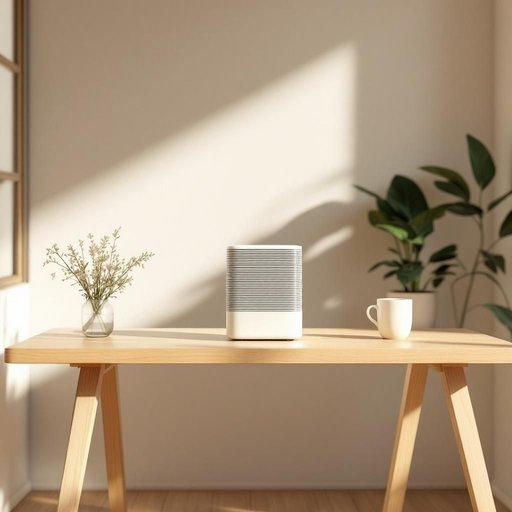

# purifier

<h1 style="font-size: 2.5em; font-weight: 300; letter-spacing: 2px; margin: 0; color: #2c3e50;">
/ˈpjʊrəˌfaɪər/
</h1>

---

---

## 例句

Although the air purifier installed in the office uses advanced filters that capture both microscopic allergens and harmful gases, many employees still prefer to keep their windows slightly open to ensure proper ventilation and maintain a comfortable working environment.

*Although(/ˌɔlˈðoʊ/) the(/ðə/) air(/ɛr/) purifier(/ˈpjʊrəˌfaɪər/) installed(/ˌɪnˈstɔld/) in(/ɪn/) the(/ðə/) office(/ˈɔfəs/) uses(/ˈjuzɪz/) advanced(/ədˈvænst/) filters(/ˈfɪltərz/) that(/ðət/) capture(/ˈkæpʧər/) both(/boʊθ/) microscopic(/ˌmaɪkrəˈskɑpɪk/) allergens(/ˈælərʤənz/) and(/ənd/) harmful(/ˈhɑrmfəl/) gases,(/ˈgæsɪz,/) many(/ˈmɛni/) employees(/ɪmˈplɔɪiz/) still(/stɪl/) prefer(/prɪˈfər/) to(/tɪ/) keep(/kip/) their(/ðɛr/) windows(/ˈwɪndoʊz/) slightly(/sˈlaɪtli/) open(/ˈoʊpən/) to(/tɪ/) ensure(/ɪnˈʃʊr/) proper(/ˈprɑpər/) ventilation(/ˌvɛntɪˈleɪʃən/) and(/ənd/) maintain(/meɪnˈteɪn/) a(/ə/) comfortable(/ˈkəmfərtəbəl/) working(/ˈwərkɪŋ/) environment.(/ɪnˈvaɪrənmənt./)*

**翻译：** 尽管办公室内安装的空气净化器采用了能够过滤微小过敏原和有害气体的先进滤网，但许多员工仍倾向于略微开启窗户，以确保空气流通，营造舒适的工作环境。

---

## 解释

英语单词"purifier"作为名词，在家居生活用品的语境中常指用于净化空气、水或其他介质的装置或设备，如空气净化器（air purifier）和水质净化器（water purifier）。具体使用场合通常涉及提升生活环境质量，如减少室内空气中的污染物、异味或细菌，或过滤自来水中的杂质和有害物质，常见于家庭、办公或公共场所。英语学习者在使用"purifier"时需要注意它是可数名词，可与不定冠词"a"或"an"连用，且常与具体净化对象连用形成常见搭配，如"air purifier"（空气净化器）、"water purifier"（净水器），表达时通常强调设备的功能性。此外，该词形态为名词，不能直接用作动词，相关动词为"purify"。词源方面，“purifier”源自拉丁语“purificare”，意为“使纯净”，由“purus”（纯净的）和“-ficare”（使得）构成，英文中后缀“-er”表示“执行某动作的人或物”，因此“purifier”即“净化者”或“净化装置”。在中文语境中，"purifier"通常准确译为“净化器”，具体视净化对象不同可细分为“空气净化器”“净水器”等，含义明确且中性，无特殊褒贬色彩，反映的是一种改善生活质量、保障健康的实用家电。从文化角度看，随着环保和健康意识的提高，"purifier"类产品的使用频率和关注度显著增加，成为现代家庭生活中常见的必备品。

---

<small style="color: #999; font-size: 0.9em;">2025-07-27 09:14:04</small>

