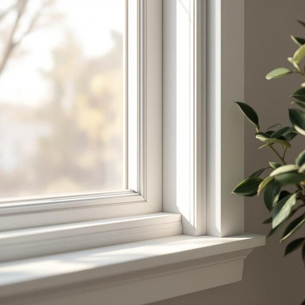

# pvc

<h1 style="font-size: 2.5em; font-weight: 300; letter-spacing: 2px; margin: 0; color: #2c3e50;">
/pvc*/
</h1>

---

---

## 例句

I decided to replace the old, cracked window seals with new PVC strips, which not only provide better insulation against the chilly drafts but are also remarkably easy to clean, ensuring that the conservatory remains cosy and bright even during the harshest winter months.

*I(/aɪ/) decided(/ˌdɪˈsaɪdɪd/) to(/tɪ/) replace(/ˌriˈpleɪs/) the(/ðə/) old,(/oʊld,/) cracked(/krækt/) window(/ˈwɪndoʊ/) seals(/silz/) with(/wɪθ/) new(/nu/) PVC(/pvc*/) strips,(/strɪps,/) which(/wɪʧ/) not(/nɑt/) only(/ˈoʊnli/) provide(/prəˈvaɪd/) better(/ˈbɛtər/) insulation(/ˌɪnsəˈleɪʃən/) against(/əˈgɛnst/) the(/ðə/) chilly(/ˈʧɪli/) drafts(/dræfts/) but(/bət/) are(/ər/) also(/ˈɔlsoʊ/) remarkably(/rɪˈmɑrkəbli/) easy(/ˈizi/) to(/tɪ/) clean,(/klin,/) ensuring(/ɪnˈʃʊrɪŋ/) that(/ðət/) the(/ðə/) conservatory(/kənˈsərvətɔri/) remains(/rɪˈmeɪnz/) cosy(/ˈkoʊzi/) and(/ənd/) bright(/braɪt/) even(/ˈivɪn/) during(/ˈdʊrɪŋ/) the(/ðə/) harshest(/ˈhɑrʃəst/) winter(/ˈwɪntər/) months.(/mənθs./)*

**翻译：** 我决定用新的PVC密封条替换旧的破裂窗密封条，这不仅能更有效地防止寒风渗入，还极易清洁，确保温室即使在最严寒的冬季也能保持温暖明亮。

---

## 解释

英语单词“PVC”作为名词在家居生活用品的语境中，通常指聚氯乙烯（Polyvinyl Chloride），是一种常用的合成塑料材料，广泛应用于管道、地板、窗框、家具覆盖层以及各种防水、防腐的家用产品中。在具体使用场合，如购买或讨论家居建材、装修材料、家具保护膜时，PVC常被提及，英语学习者需注意“PVC”作为不可数名词使用，通常不加复数形式，也常与其他名词搭配，如“PVC pipes”（PVC管）、“PVC flooring”（PVC地板）、“PVC sheets”（PVC板材）等。在语法上，“PVC”多用作物质名词，且一般不用作形容词，但在非正式语境中有时可作复合名词前的修饰成分，如“PVC door”指用PVC材料制成的门。词源上，“PVC”是Polyvinyl Chloride的缩写，源于20世纪初合成塑料的发展，是一种由乙烯和氯气聚合而成的高分子化合物。中文语境中，“PVC”常译为“聚氯乙烯”或直接称为“PVC”，理解时应明确其属性为塑料材料而非具体商品，本身无褒贬色彩，属于中性词汇，但在环保语境下可能因不可降解性而带有一定负面含义，因此在使用时需根据具体语境判断。

---

<small style="color: #999; font-size: 0.9em;">2025-07-27 09:14:04</small>

