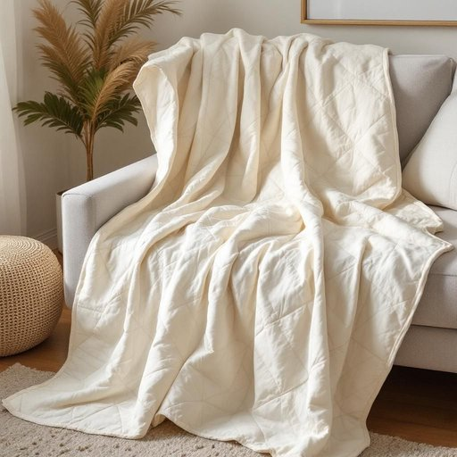

# quilt

<h1 style="font-size: 2.5em; font-weight: 300; letter-spacing: 2px; margin: 0; color: #2c3e50;">
/kwɪlt/
</h1>

---

---

## 例句

On chilly evenings, I often wrap myself in the handmade quilt that my grandmother stitched, not only because its intricate patchwork patterns and thick cotton filling provide exceptional warmth, but also because it carries the comforting scent of home, making the living room feel more inviting and nostalgic.

*On(/ɔn/) chilly(/ˈʧɪli/) evenings,(/ˈivnɪŋz,/) I(/aɪ/) often(/ˈɔfən/) wrap(/ræp/) myself(/ˌmaɪˈsɛlf/) in(/ɪn/) the(/ðə/) handmade(/ˈhænˈmeɪd/) quilt(/kwɪlt/) that(/ðət/) my(/maɪ/) grandmother(/ˈgrændˌməðər/) stitched,(/stɪʧt,/) not(/nɑt/) only(/ˈoʊnli/) because(/bɪˈkəz/) its(/ɪts/) intricate(/ˈɪntrəkət/) patchwork(/ˈpæʧˌwərk/) patterns(/ˈpætərnz/) and(/ənd/) thick(/θɪk/) cotton(/ˈkɔtən/) filling(/ˈfɪlɪŋ/) provide(/prəˈvaɪd/) exceptional(/ɪkˈsɛpʃənəl/) warmth,(/wɔrmθ,/) but(/bət/) also(/ˈɔlsoʊ/) because(/bɪˈkəz/) it(/ɪt/) carries(/ˈkɛriz/) the(/ðə/) comforting(/ˈkəmfərtɪŋ/) scent(/sɛnt/) of(/əv/) home,(/hoʊm,/) making(/ˈmeɪkɪŋ/) the(/ðə/) living(/ˈlɪvɪŋ/) room(/rum/) feel(/fil/) more(/mɔr/) inviting(/ˌɪnˈvaɪtɪŋ/) and(/ənd/) nostalgic.(/nɔˈstælʤɪk./)*

**翻译：** 在寒冷的夜晚，我常裹着祖母亲手缝制的拼布被，不仅因其复杂的拼接图案与厚实的棉絮带来格外的温暖，更因那承载着家的馨香，使客厅氛围倍感温馨与怀旧。

---

## 解释

单词“quilt”作为名词在家居生活用品场景中指的是一种用多层布料（通常是两层布之间夹着填充物）缝合在一起制成的被子，主要用以保暖，常见于卧室内铺床或盖被。具体使用时，多出现在描述寝具、卧室陈设或冬季保暖用品等语境中，如“一床保暖的被子”或“手工被子”。英语学习者在使用该词时应注意其不可数名词和可数名词用法均存在，但用作家居用品时通常为可数，且“quilt”常同伴“bed”、“cover”、“blanket”、“patchwork”（拼布）等词搭配，形成如“patchwork quilt”表示拼布被等常见表达。此外，“quilt”既可指被子整体也可指特定款式，使用时避免与“blanket”混淆，后者更为单层且通常无填充物。词源方面，“quilt”一词来源于拉丁语“culcita”，意为“垫子、软垫”，经由古法语“cuilte”传入英语，反映出其作为被褥的历史背景和工艺特征，体现传统手工缝制的文化价值。在中文语境中，“quilt”应准确译为“被子”或“棉被”，强调其多层缝合和保暖功能，与普通单层毯子区分开。该词汇无明显褒贬色彩，但作为传统手工艺品时，常隐含温馨、舒适和家庭氛围的文化内涵。

---

<small style="color: #999; font-size: 0.9em;">2025-07-27 09:14:04</small>

