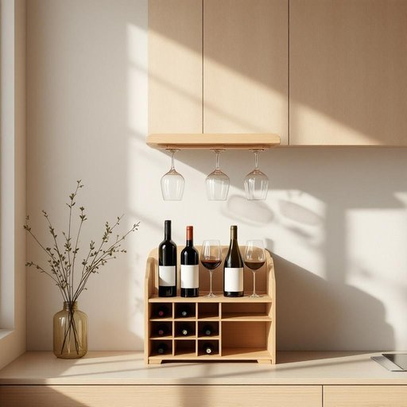

# rack

<h1 style="font-size: 2.5em; font-weight: 300; letter-spacing: 2px; margin: 0; color: #2c3e50;">
/ræk/
</h1>

---

---

## 例句

After tidying up the kitchen, she carefully placed the delicate wine glasses on the newly installed wooden rack, which, despite its compact size, was cleverly designed to hold several bottles and prevent them from clinking against each other during any slight movement.

*After(/ˈæftər/) tidying(/tidying*/) up(/əp/) the(/ðə/) kitchen,(/ˈkɪʧən,/) she(/ʃi/) carefully(/ˈkɛrfəli/) placed(/pleɪst/) the(/ðə/) delicate(/ˈdɛləkət/) wine(/waɪn/) glasses(/ˈglæsɪz/) on(/ɔn/) the(/ðə/) newly(/ˈnuli/) installed(/ˌɪnˈstɔld/) wooden(/ˈwʊdən/) rack,(/ræk,/) which,(/wɪʧ,/) despite(/dɪˈspaɪt/) its(/ɪts/) compact(/ˈkɑmpækt/) size,(/saɪz,/) was(/wɑz/) cleverly(/ˈklɛvərli/) designed(/dɪˈzaɪnd/) to(/tɪ/) hold(/hoʊld/) several(/ˈsɛvərəl/) bottles(/ˈbɑtəlz/) and(/ənd/) prevent(/prɪˈvɛnt/) them(/ðɛm/) from(/frəm/) clinking(/clinking*/) against(/əˈgɛnst/) each(/iʧ/) other(/ˈəðər/) during(/ˈdʊrɪŋ/) any(/ˈɛni/) slight(/slaɪt/) movement.(/ˈmuvmənt./)*

**翻译：** 整理完厨房后，她小心翼翼地将精致的酒杯摆放在新安装的木质酒架上。酒架虽然体积小巧，但设计巧妙，既能放下几瓶酒，又能防止瓶身在轻微晃动时相互碰撞。

---

## 解释

英语单词“rack”在家居生活用品的语境中作为名词，通常指用来放置或存储物品的架子或支架，具体场合包括厨房中的餐具架、浴室的毛巾架、客厅或卧室的书架或鞋架等，常见于描述某物放置的场所或组织物品时使用。英语学习者在使用“rack”时需要注意它常作为可数名词出现，复数形式为“racks”，同时常与介词搭配如“on the rack”（在架子上）；此外，常见表达有“wine rack”（酒架）、“shoe rack”（鞋架）、“towel rack”（毛巾架）等，搭配较为固定，有助于表达具体生活情境。词源方面，“rack”源自中古英语，最初含义多指用于悬挂或支撑的框架或架子，源于古英语“ræcc”，延伸为支撑或承载物品的结构。中文语境中，“rack”准确翻译为“架子”或“支架”，强调其用于放置和整理物品的功能，通常无褒贬色彩，但在某些特殊历史语境中，如“torture rack”意为“拷问架”，带有负面含义，但在家居用品语境完全无此色彩，属于中性词汇。总体而言，“rack”在家居生活中是一个方便描述收纳设施的实用词汇，使用时注意其具体搭配和语境即可。

---

<small style="color: #999; font-size: 0.9em;">2025-07-27 09:14:04</small>

