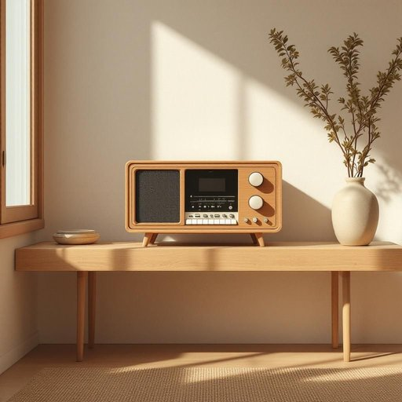

# radio

<h1 style="font-size: 2.5em; font-weight: 300; letter-spacing: 2px; margin: 0; color: #2c3e50;">
/ˈreɪdiˌoʊ/
</h1>

---

---

## 例句

While I was tidying up the living room, I noticed that the radio, which usually sits on the wooden shelf near the window and plays classical music softly in the background, had stopped working, prompting me to check if it was a simple issue like a loose plug or if it needed a complete repair.

*While(/waɪl/) I(/aɪ/) was(/wɑz/) tidying(/tidying*/) up(/əp/) the(/ðə/) living(/ˈlɪvɪŋ/) room,(/rum,/) I(/aɪ/) noticed(/ˈnoʊtɪst/) that(/ðət/) the(/ðə/) radio,(/ˈreɪdiˌoʊ,/) which(/wɪʧ/) usually(/ˈjuʒəwəli/) sits(/sɪts/) on(/ɔn/) the(/ðə/) wooden(/ˈwʊdən/) shelf(/ʃɛlf/) near(/nɪr/) the(/ðə/) window(/ˈwɪndoʊ/) and(/ənd/) plays(/pleɪz/) classical(/ˈklæsɪkəl/) music(/mˈjuzɪk/) softly(/ˈsɔftli/) in(/ɪn/) the(/ðə/) background,(/ˈbækˌgraʊnd,/) had(/hæd/) stopped(/stɑpt/) working,(/ˈwərkɪŋ,/) prompting(/ˈprɑmptɪŋ/) me(/mi/) to(/tɪ/) check(/ʧɛk/) if(/ɪf/) it(/ɪt/) was(/wɑz/) a(/ə/) simple(/ˈsɪmpəl/) issue(/ˈɪʃu/) like(/laɪk/) a(/ə/) loose(/lus/) plug(/pləg/) or(/ər/) if(/ɪf/) it(/ɪt/) needed(/ˈnidɪd/) a(/ə/) complete(/kəmˈplit/) repair.(/rɪˈpɛr./)*

**翻译：** 当我整理起客厅时，注意到平时放在靠窗木架上、轻柔播放古典音乐的收音机突然坏了，这促使我检查是否只是插头松动这样的简单问题，还是需要进行彻底修理。

---

## 解释

英语单词“radio”作为名词，在家居生活用品的语境中，通常指的是一种电子设备，用于接收无线电波并转换成声音信号，供家庭成员收听新闻、音乐或其他广播内容。具体使用场合多见于客厅、卧室或厨房等家庭环境，通常是指便携式或固定式的收音机。在英语学习中，注意“radio”作为可数名词时，复数形式为“radios”，例如“two radios”；但表示广播电台或无线电广播时，常作为不可数名词出现，如“listen to radio”。常见搭配有“turn on/off the radio”（打开/关闭收音机）、“listen to the radio”（听收音机）、“radio station”（广播电台）、“radio program”（广播节目）等。词源方面，“radio”源自拉丁词根“radius”，意指“光线”或“射线”，19世纪末到20世纪初随着无线电技术的发展，逐渐被用来指代无线电设备。中文中，“radio”准确翻译为“收音机”，强调其作为家用电器的功能和用途。在中文文化语境中，“收音机”是较为中性且广泛接受的表达，既无褒义也无贬义，更多体现了一种传统家庭娱乐和信息获取工具的形象。总的来说，“radio”作为家居用品名词时，指代的是一种接收广播信号的装置，其用法和搭配较为固定，学习时应注意其可数与不可数的不同语境，以准确表达意思。

---

<small style="color: #999; font-size: 0.9em;">2025-07-27 09:14:04</small>

