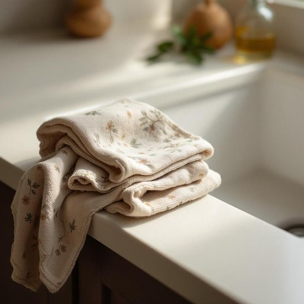

# rag

<h1 style="font-size: 2.5em; font-weight: 300; letter-spacing: 2px; margin: 0; color: #2c3e50;">
/ræg/
</h1>

---

---

## 例句

Could you please hand me that old rag, which has the faded floral pattern and has been sitting by the sink, so I can wipe down the kitchen counter and finally get rid of those stubborn coffee stains that have been there since this morning?

*Could(/kʊd/) you(/ju/) please(/pliz/) hand(/hænd/) me(/mi/) that(/ðət/) old(/oʊld/) rag,(/ræg,/) which(/wɪʧ/) has(/həz/) the(/ðə/) faded(/ˈfeɪdɪd/) floral(/ˈflɔrəl/) pattern(/ˈpætərn/) and(/ənd/) has(/həz/) been(/bɪn/) sitting(/ˈsɪtɪŋ/) by(/baɪ/) the(/ðə/) sink,(/sɪŋk,/) so(/soʊ/) I(/aɪ/) can(/kən/) wipe(/waɪp/) down(/daʊn/) the(/ðə/) kitchen(/ˈkɪʧən/) counter(/ˈkaʊntər/) and(/ənd/) finally(/ˈfaɪnəli/) get(/gɪt/) rid(/rɪd/) of(/əv/) those(/ðoʊz/) stubborn(/ˈstəbərn/) coffee(/ˈkɔfi/) stains(/steɪnz/) that(/ðət/) have(/hæv/) been(/bɪn/) there(/ðɛr/) since(/sɪns/) this(/ðɪs/) morning?(/ˈmɔrnɪŋ?/)*

**翻译：** 请把那个放在水槽边、图案已经褪色的旧抹布递给我，好让我擦拭厨房台面，终于清除自今晨以来一直存在的顽固咖啡渍。

---

## 解释

英语单词“rag”作为名词在家居生活用品的语境中，通常指的是用来清洁、擦拭家具、地板或器具的破旧布片或抹布，具体使用场合多见于打扫卫生、擦窗户、擦拭油污或灰尘时。在英语学习者使用该词时，需注意“rag”多用于不可数名词或复数形式“rags”，且常与动词如“wipe”、“clean”、“dust”等搭配，如“use a rag to clean the table”。此外，短语如“old rag”或“dust rag”较为常见，表达了一块或几块用于清洁的旧布。该词来源于中古英语“ragge”，意指破布、旧布，其根源可追溯到更早的日耳曼语族，体现了其与破旧布料的紧密联系。在中文语境中，准确翻译为“抹布”或“破布”，强调其在家居清洁中的作用。需要特别指出的是，“rag”有时在非正式或口语表达中也可引申为贬义，指代“破烂衣服”或带有轻蔑的语气描述某物品破旧、低劣，但在家居生活用品范畴内通常无褒贬色彩，仅作实用工具理解。综上，理解“rag”在此场景中的意义，关键在于其作为清洁用破布的实用功能及常见搭配表达。

---

<small style="color: #999; font-size: 0.9em;">2025-07-27 09:14:04</small>

