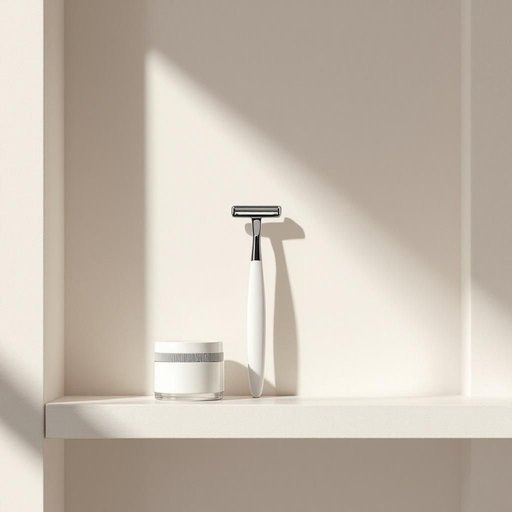

# razor

<h1 style="font-size: 2.5em; font-weight: 300; letter-spacing: 2px; margin: 0; color: #2c3e50;">
/ˈreɪzər/
</h1>

---

---

## 例句

Could you please pass me the razor that's usually kept next to the shaving cream on the bathroom shelf, as I need to trim my beard before we head out to the dinner party tonight?

*Could(/kʊd/) you(/ju/) please(/pliz/) pass(/pæs/) me(/mi/) the(/ðə/) razor(/ˈreɪzər/) that's(/ðæts/) usually(/ˈjuʒəwəli/) kept(/kɛpt/) next(/nɛkst/) to(/tɪ/) the(/ðə/) shaving(/ˈʃeɪvɪŋ/) cream(/krim/) on(/ɔn/) the(/ðə/) bathroom(/ˈbæθˌrum/) shelf,(/ʃɛlf,/) as(/ɛz/) I(/aɪ/) need(/nid/) to(/tɪ/) trim(/trɪm/) my(/maɪ/) beard(/bɪrd/) before(/ˌbiˈfɔr/) we(/wi/) head(/hɛd/) out(/aʊt/) to(/tɪ/) the(/ðə/) dinner(/ˈdɪnər/) party(/ˈpɑrti/) tonight?(/təˈnaɪt?/)*

**翻译：** 请你帮我递一下浴室架子上通常放在剃须膏旁边的剃刀吗？我需要在我们今晚去晚宴前修整一下胡须。

---

## 解释

英语单词“razor”作为名词，在家居生活用品场景中主要指剃须刀或刮毛刀，通常用于剃须、修剪或整理体毛，常见于浴室或梳妆台。使用时，常见表达有“electric razor”（电动剃须刀）、“safety razor”（安全剃须刀）以及“razor blade”（剃须刀片），学习者需注意“razor”通常作可数名词，复数形式为“razors”，且在具体修饰时常与材质或功能词连用，如“disposable razor”（一次性剃须刀）。此外，“razor”在语法结构中多作为名词使用，可作主语、宾语或同位语，且常搭配动词如“use”“buy”“shave with”等。词源上，“razor”源自中古英语“rasour”，源于古法语“raser”意为“剃”，而更深层来自拉丁语“radere”，意指“刮除、削去”，体现了其剃除毛发的功能属性。在中文语境中，“razor”准确译为“剃须刀”或“刮刀”，根据具体用途有时也称为“刮胡刀”，具有中性词义，无褒贬色彩，但在不同文化背景下，“razor”象征着整洁与男性气质的典型工具。综上，“razor”作为家居生活用品的名词，指代功能明确的剃须工具，是英语日常生活词汇中不可或缺的一部分。

---

<small style="color: #999; font-size: 0.9em;">2025-07-27 09:14:04</small>

