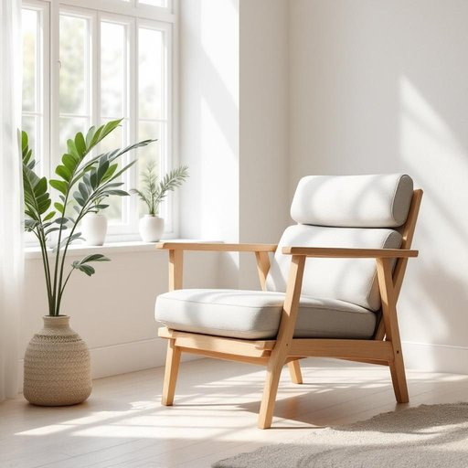

# recliner

<h1 style="font-size: 2.5em; font-weight: 300; letter-spacing: 2px; margin: 0; color: #2c3e50;">
/rɪˈklaɪnər/
</h1>

---

---

## 例句

After a long day at work, I usually sink into the recliner by the bay window, which, with its plush cushions and adjustable backrest, provides the perfect combination of comfort and support for reading or simply unwinding while watching the rain outside.

*After(/ˈæftər/) a(/ə/) long(/lɔŋ/) day(/deɪ/) at(/æt/) work,(/wərk,/) I(/aɪ/) usually(/ˈjuʒəwəli/) sink(/sɪŋk/) into(/ˈɪntu/) the(/ðə/) recliner(/rɪˈklaɪnər/) by(/baɪ/) the(/ðə/) bay(/beɪ/) window,(/ˈwɪndoʊ,/) which,(/wɪʧ,/) with(/wɪθ/) its(/ɪts/) plush(/pləʃ/) cushions(/ˈkʊʃənz/) and(/ənd/) adjustable(/əˈʤəstəbəl/) backrest,(/ˈbæˌkrɛst,/) provides(/prəˈvaɪdz/) the(/ðə/) perfect(/ˈpərˌfɪkt/) combination(/ˌkɑmbəˈneɪʃən/) of(/əv/) comfort(/ˈkəmfərt/) and(/ənd/) support(/səˈpɔrt/) for(/fər/) reading(/ˈrɛdɪŋ/) or(/ər/) simply(/ˈsɪmpli/) unwinding(/ənˈwaɪndɪŋ/) while(/waɪl/) watching(/ˈwɑʧɪŋ/) the(/ðə/) rain(/reɪn/) outside.(/ˈaʊtˈsaɪd./)*

**翻译：** 经过一天的辛劳工作，我通常会坐到靠近落地窗的躺椅上，那张椅子配有柔软的靠垫和可调节的靠背，完美地结合了舒适与支撑，既适合阅读，也适合静静地欣赏窗外的细雨，放松身心。

---

## 解释

英语单词“recliner”在家居生活用品场景中作为名词，通常指一种可以调节靠背角度甚至带有脚踏板的躺椅，使用者可以通过调节装置使椅子部分或完全放平，从而实现更舒适的休息姿势。具体使用场合多见于客厅、休闲区、影音室等家庭环境，常用于描述一种便于放松、观看电视或小憩的家具。英语学习者在使用“recliner”时需注意，它是可数名词，复数形式为“recliners”，与动词搭配时应根据具体语法结构选择单复数形式；常见的搭配表达包括“a comfortable recliner”，“adjust the recliner”，“recliner chair”，以及“pull the lever on the recliner”等，表达调节或使用椅子的动作。词源上，“recliner”来自动词“recline”，意为“向后靠，倾斜”，加上名词后缀“-er”表示“能够倾斜靠背的人或物”，即“可倾斜的椅子”。在中文语境中，“recliner”准确翻译为“躺椅”或“可躺式沙发椅”，强调其可以调节姿势的功能，不应简单理解为普通椅子或沙发。该词本身无明显褒贬色彩，在现代家庭生活中多呈现舒适、放松的正面文化内涵，是现代家居休闲的重要组成部分。

---

<small style="color: #999; font-size: 0.9em;">2025-07-27 09:14:04</small>

