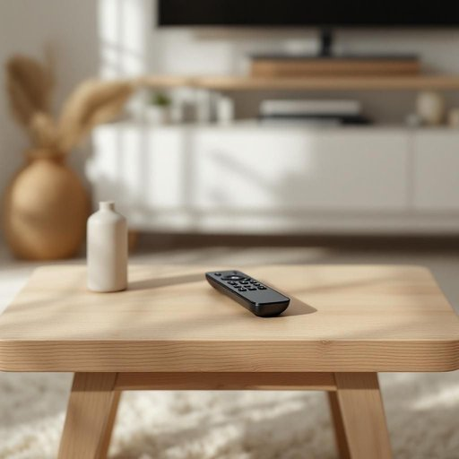

# remote

<h1 style="font-size: 2.5em; font-weight: 300; letter-spacing: 2px; margin: 0; color: #2c3e50;">
/rɪˈmoʊt/
</h1>

---

---

## 例句

The remote on the coffee table serves as a crucial tool for controlling the television, especially when one wishes to effortlessly switch channels or adjust the volume after a long day of work.

*The(/ðə/) remote(/rɪˈmoʊt/) on(/ɔn/) the(/ðə/) coffee(/ˈkɔfi/) table(/ˈteɪbəl/) serves(/sərvz/) as(/ɛz/) a(/ə/) crucial(/ˈkruʃəl/) tool(/tul/) for(/fər/) controlling(/kənˈtroʊlɪŋ/) the(/ðə/) television,(/ˈtɛləˌvɪʒən,/) especially(/əˈspɛʃəli/) when(/wɪn/) one(/wən/) wishes(/ˈwɪʃɪz/) to(/tɪ/) effortlessly(/ˈɛfərtləsli/) switch(/swɪʧ/) channels(/ˈʧænəlz/) or(/ər/) adjust(/əˈʤəst/) the(/ðə/) volume(/ˈvɑljum/) after(/ˈæftər/) a(/ə/) long(/lɔŋ/) day(/deɪ/) of(/əv/) work.(/wərk./)*

**翻译：** 茶几上的遥控器是控制电视的重要工具，尤其是在忙碌一天后，人们希望轻松换台或调节音量时。

---

## 解释

英语单词“remote”作为名词，在家居生活用品场景中通常指“遥控器”，即用于远距离控制电视、空调等电子设备的小型手持装置。具体使用场合多见于日常对话中，如说“Please pass me the remote”意为“请把遥控器递给我”。英语学习者须注意“remote”作为名词时多用简单形式，复数为“remotes”，且常与动词“use”、“pass”、“find”等搭配使用；另外，“remote”作为形容词时含义完全不同，表示“遥远的”或“偏远的”，需根据语境辨别。词源方面，“remote”源自拉丁语“remotus”，意为“远离的”，其作为名词的含义主要起源于20世纪电子产品普及后对遥控装置的简短称呼。在中文语境中，“remote”作为名词准确的翻译是“遥控器”，该词没有褒贬色彩，属于中性且广泛使用的生活用语，文化上无特殊含义，但需避免与形容词含义混淆。

---

<small style="color: #999; font-size: 0.9em;">2025-07-27 09:14:04</small>

