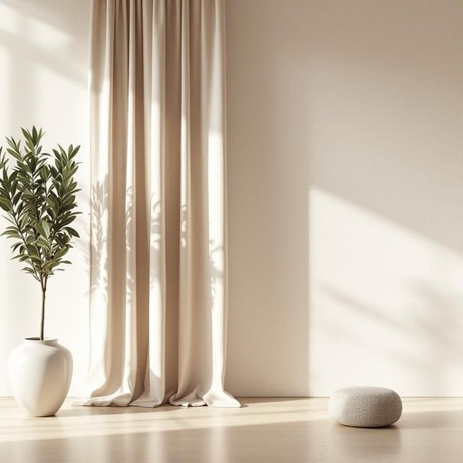

# rod

<h1 style="font-size: 2.5em; font-weight: 300; letter-spacing: 2px; margin: 0; color: #2c3e50;">
/rɑd/
</h1>

---

---

## 例句

Before we finalize the purchase, the rod's durability as a critical component in supporting the curtain's weight and aesthetic appeal must be thoroughly evaluated to ensure it complements both function and design.

*Before(/ˌbiˈfɔr/) we(/wi/) finalize(/ˈfaɪnəˌlaɪz/) the(/ðə/) purchase,(/ˈpərʧəs,/) the(/ðə/) rod's(/rod's*/) durability(/dərəˈbɪlɪti/) as(/ɛz/) a(/ə/) critical(/ˈkrɪtɪkəl/) component(/kəmˈpoʊnənt/) in(/ɪn/) supporting(/səˈpɔrtɪŋ/) the(/ðə/) curtain's(/curtain's*/) weight(/weɪt/) and(/ənd/) aesthetic(/ɛsˈθɛtɪk/) appeal(/əˈpil/) must(/məst/) be(/bi/) thoroughly(/ˈθəroʊli/) evaluated(/ɪˈvæljuˌeɪtəd/) to(/tɪ/) ensure(/ɪnˈʃʊr/) it(/ɪt/) complements(/ˈkɑmpləmənts/) both(/boʊθ/) function(/ˈfəŋkʃən/) and(/ənd/) design.(/dɪˈzaɪn./)*

**翻译：** 在最终确认购买之前，作为承托窗帘重量及美观效果的重要部件，杆件的耐用性必须经过全面评估，以确保其兼顾功能与设计。

---

## 解释

英语单词“rod”在家居生活用品的语境中作为名词，通常指细长的杆状物体，如窗帘杆、挂衣杆、晾衣杆等，具体使用场合包括挂置窗帘、悬挂衣物或者支撑某些家具部件时。例如，“curtain rod”表示窗帘杆，“clothes rod”表示挂衣杆。英语学习者在使用“rod”时应注意其单数和复数形式（复数为“rods”），并且通常与具体用途的名词搭配，如“一根金属杆”（a metal rod）、“张力杆”（a tension rod）。此外，“rod”在家居用品领域多指实物，需要结合上下文明确其用途，避免与其他含义混淆。词源方面，“rod”源自古英语“rodd”，意指“树枝、棍棒”，最初指天然树枝，后演变为各种细长刚硬的物体。中文语境中，“rod”对应的翻译通常为“杆”、“棒”，在家居用品领域多指“杆子”，强调其细长结实的形态，无明显褒贬色彩或特殊文化内涵，但有时也象征坚固、支撑等功能性意义，需根据具体语境理解。

---

<small style="color: #999; font-size: 0.9em;">2025-07-27 09:14:04</small>

