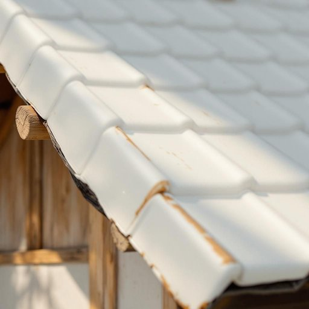

# roof

<h1 style="font-size: 2.5em; font-weight: 300; letter-spacing: 2px; margin: 0; color: #2c3e50;">
/rʊf/
</h1>

---

---

## 例句

The roof of the old cottage, which had been leaking during heavy rains last winter and causing damage to the wooden beams and ceiling panels, finally requires repair before the arrival of the next storm.

*The(/ðə/) roof(/rʊf/) of(/əv/) the(/ðə/) old(/oʊld/) cottage,(/ˈkɑtɪʤ,/) which(/wɪʧ/) had(/hæd/) been(/bɪn/) leaking(/ˈlikɪŋ/) during(/ˈdʊrɪŋ/) heavy(/ˈhɛvi/) rains(/reɪnz/) last(/læst/) winter(/ˈwɪntər/) and(/ənd/) causing(/ˈkɔzɪŋ/) damage(/ˈdæmɪʤ/) to(/tɪ/) the(/ðə/) wooden(/ˈwʊdən/) beams(/bimz/) and(/ənd/) ceiling(/ˈsilɪŋ/) panels,(/ˈpænəlz,/) finally(/ˈfaɪnəli/) requires(/rikˈwaɪərz/) repair(/rɪˈpɛr/) before(/ˌbiˈfɔr/) the(/ðə/) arrival(/ərˈaɪvəl/) of(/əv/) the(/ðə/) next(/nɛkst/) storm.(/stɔrm./)*

**翻译：** 这座老农舍的屋顶在去年冬天的大雨中一直渗漏，导致木梁和天花板受损，如今在下一场暴风雨来临之前，终于需要修缮。

---

## 解释

roof作为名词指房屋或建筑物的顶盖部分，主要描述覆盖建筑物上方起保护作用的结构，防止风雨阳光和其他自然因素侵袭，在家居生活用品语境中常用于讨论房屋设计建筑结构维修修缮等场合如“The roof needs repair”（屋顶需要修理）或“The snow accumulated on the roof”（积雪落在屋顶上），英语学习者需注意其复数形式为roofs现代英语中rooves较少用且常见搭配包括“flat roof”（平屋顶）、“slate roof”（板岩屋顶）、“roof tiles”（屋顶瓦片）等此外roof可以与介词搭配形成固定表达如“under one roof”（在同一个屋檐下意指在同一个地方），词源来自古英语rōf根源可追溯至日耳曼语族涵盖遮盖覆盖物概念体现了该词从古至今的使用连续性，中文语境中准确翻译为“屋顶”或“房顶”强调建筑物上方的覆盖结构没有特别褒贬色彩或特殊文化内涵使用时应根据具体建筑形式和语境选择合适译法避免混淆为室内的“天花板”或“顶棚”它们在英语中通常用ceiling表示总体而言roof是描述建筑顶盖不可或缺的名词使用时应注意其具体指代的外部结构和相关固定搭配

---

<small style="color: #999; font-size: 0.9em;">2025-07-27 09:14:04</small>

