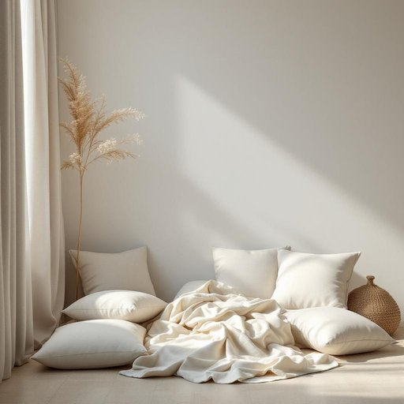

# room

<h1 style="font-size: 2.5em; font-weight: 300; letter-spacing: 2px; margin: 0; color: #2c3e50;">
/rum/
</h1>

---

---

## 例句

Could you please tidy up the room where we usually keep the extra blankets and cushions, which tend to get scattered all over the floor whenever the kids play indoors during rainy afternoons?

*Could(/kʊd/) you(/ju/) please(/pliz/) tidy(/ˈtaɪdi/) up(/əp/) the(/ðə/) room(/rum/) where(/wɛr/) we(/wi/) usually(/ˈjuʒəwəli/) keep(/kip/) the(/ðə/) extra(/ˈɛkstrə/) blankets(/ˈblæŋkəts/) and(/ənd/) cushions,(/ˈkʊʃənz,/) which(/wɪʧ/) tend(/tɛnd/) to(/tɪ/) get(/gɪt/) scattered(/ˈskætərd/) all(/ɔl/) over(/ˈoʊvər/) the(/ðə/) floor(/flɔr/) whenever(/wɛˈnɛvər/) the(/ðə/) kids(/kɪdz/) play(/pleɪ/) indoors(/ˈɪnˌdɔrz/) during(/ˈdʊrɪŋ/) rainy(/ˈreɪni/) afternoons?(/ˌæftərˈnunz?/)*

**翻译：** 你能把我们平时放额外毛毯和靠垫的房间整理一下吗？那些东西每逢雨天下午孩子们在屋里玩时，总是散落一地。

---

## 解释

英语单词“room”作为名词在家居生活用品的语境中，主要指房屋内部的独立空间，如卧室、客厅、厨房等，用于区分不同功能和用途的居住区域。具体使用场合包括描述居家环境、安排空间布局、谈论居住条件等，如“living room”（客厅）、“bedroom”（卧室）、“dining room”（餐厅）。英语学习者使用该词时需注意其可数名词属性，通常表示单个独立空间，且可用复数形式“rooms”表示多个房间。常见搭配有“a room with a view”（有景观的房间）、“in the room”（在房间里）、“make room for”（为……腾出空间）等表达技巧。语法上，“room”可作为主语、宾语，后接介词短语或修饰语，且在表示“空间、余地”时，也可作不可数名词使用，如“There’s no room for doubt”（没有怀疑的余地）。词源上，“room”源自古英语“rūm”，意为“宽敞的空间”，与古诺尔斯语和德语中的类似词语同源，突显空间或容纳的概念。在中文语境中，准确翻译为“房间”，强调一个居住或活动的可分隔空间，无特殊褒贬含义，属中性词，日常使用广泛，文化上并无特别特殊色彩，但在特定语境下可引申为“空间”或“余地”，如“有时间和room去做某事”，体现灵活用法。总体而言，“room”在家居生活中是一个基础且实用的词汇，表达居住空间的核心概念，对英语学习者理解生活场景和进行实用会话极为重要。

---

<small style="color: #999; font-size: 0.9em;">2025-07-27 09:14:04</small>

