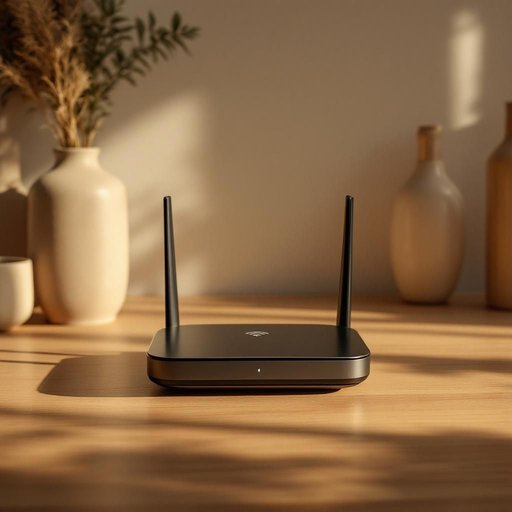

# router

<h1 style="font-size: 2.5em; font-weight: 300; letter-spacing: 2px; margin: 0; color: #2c3e50;">
/ˈrutər/
</h1>

---

---

## 例句

Despite following the troubleshooting guide step by step, the router, which had been acting up ever since we installed the new smart TV, prevented me from getting a stable Wi-Fi connection throughout the house.

*Despite(/dɪˈspaɪt/) following(/ˈfɑloʊɪŋ/) the(/ðə/) troubleshooting(/troubleshooting*/) guide(/gaɪd/) step(/stɛp/) by(/baɪ/) step,(/stɛp,/) the(/ðə/) router,(/ˈrutər,/) which(/wɪʧ/) had(/hæd/) been(/bɪn/) acting(/ˈæktɪŋ/) up(/əp/) ever(/ˈɛvər/) since(/sɪns/) we(/wi/) installed(/ˌɪnˈstɔld/) the(/ðə/) new(/nu/) smart(/smɑrt/) TV,(/ˌtɛləˈvɪʒən,/) prevented(/prɪˈvɛnɪd/) me(/mi/) from(/frəm/) getting(/ˈgɪtɪŋ/) a(/ə/) stable(/ˈsteɪbəl/) Wi-Fi(/ˈwaɪˌfaɪ/) connection(/kəˈnɛkʃən/) throughout(/θruaʊt/) the(/ðə/) house.(/haʊs./)*

**翻译：** 尽管我逐步按照故障排除指南进行操作，自从我们安装了新的智能电视后，路由器一直表现异常，导致我无法在整个房屋内获得稳定的无线网络连接。

---

## 解释

英语单词“router”在家居生活用品场景中作为名词，主要指的是用于连接家庭网络的无线或有线路由器设备，它能将互联网信号分配到多个终端设备，如手机、电脑、电视等，广泛应用于家庭网络搭建和无线网络覆盖。使用时，学习者应注意“router”多为可数名词，常见搭配包括“Wi-Fi router”（无线网络路由器）、“home router”（家用路由器）、“router settings”（路由器设置）等，表达时常与网络相关的动词搭配，如“set up a router”（设置路由器）、“connect to a router”（连接到路由器）。词源上，“router”源自英语动词“route”（意为“引导路径”）加上名词后缀“-er”，原指“引导者”或“转发者”，后来引申为网络设备中负责“路由”数据包的设备。在中文语境中，“router”准确翻译为“路由器”，这一术语已被广泛接受并固定使用，指代家庭或办公环境中实现网络数据包转发与分配功能的电子设备。需注意该词在该语境下无特殊褒贬色彩，属于中性技术用语，同时区别于木工工具“router”（电动木工雕槽机），应结合具体语境加以确认。

---

<small style="color: #999; font-size: 0.9em;">2025-07-27 09:14:04</small>

