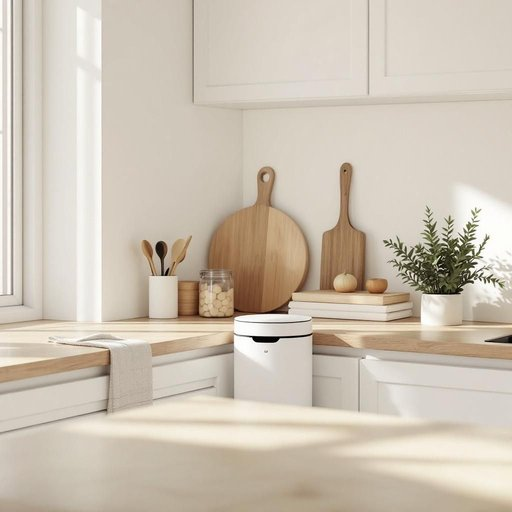

# rubbish

<h1 style="font-size: 2.5em; font-weight: 300; letter-spacing: 2px; margin: 0; color: #2c3e50;">
/ˈrəbɪʃ/
</h1>

---

---

## 例句

Could you please take out the rubbish before you start cooking, as the overflowing bin, which has been neglected for days and smells quite unpleasant, is attracting flies and making the kitchen untidy?

*Could(/kʊd/) you(/ju/) please(/pliz/) take(/teɪk/) out(/aʊt/) the(/ðə/) rubbish(/ˈrəbɪʃ/) before(/ˌbiˈfɔr/) you(/ju/) start(/stɑrt/) cooking,(/ˈkʊkɪŋ,/) as(/ɛz/) the(/ðə/) overflowing(/ˈoʊvərˌfloʊɪŋ/) bin,(/bɪn,/) which(/wɪʧ/) has(/həz/) been(/bɪn/) neglected(/nɪˈglɛktɪd/) for(/fər/) days(/deɪz/) and(/ənd/) smells(/smɛlz/) quite(/kwaɪt/) unpleasant,(/ənˈplɛzənt,/) is(/ɪz/) attracting(/əˈtræktɪŋ/) flies(/flaɪz/) and(/ənd/) making(/ˈmeɪkɪŋ/) the(/ðə/) kitchen(/ˈkɪʧən/) untidy?(/ənˈtaɪdi?/)*

**翻译：** 在您开始做饭之前，能否请您先把垃圾拿出去？堆放多日、散发难闻气味且已经溢满的垃圾桶正吸引苍蝇，导致厨房变得不整洁。

---

## 解释

英语单词“rubbish”在家居生活用品场景中作为名词，主要指废弃物、垃圾、废品，通常用于描述家庭中产生的各种废弃物，如厨房垃圾、破损的生活用品、纸屑等。具体使用场合多见于日常生活对话或家务管理相关语境，如“Please take out the rubbish”（请把垃圾倒掉）或“Put the rubbish in the bin”（把垃圾放进垃圾桶），强调对废弃物的处理。学习者在使用“rubbish”作为名词时需要注意其为不可数名词，通常不直接用复数形式，且常与冠词“the”连用，指特定的垃圾；此外，常见搭配包括“rubbish bin/truck/collection”，表示垃圾桶、垃圾车、垃圾收集等，表达时要根据具体物品选择合适的搭配。词源方面，“rubbish”源自中古英语，可能来自古法语“rubbis”，指建筑废料、碎石等，逐渐演变为泛指废弃物或无用物的含义。在中文语境中，准确翻译为“垃圾”或“废弃物”，在家居生活中多指日常生活产生的废弃垃圾。需要注意的是，“rubbish”作为口语词汇，有时带有轻微贬义，用于形容某物“没用”、“无价值”，但在描述实际废弃物时则是中性用法。在英式英语中“rubbish”较为常用，而美式英语中更常用“trash”或“garbage”。综上，“rubbish”作为名词在家庭生活中主要指废弃垃圾，用法明确且频繁，学习者需掌握其不可数特性和常见搭配，同时理解其文化语境及轻微的语义色彩。

---

<small style="color: #999; font-size: 0.9em;">2025-07-27 09:14:04</small>

