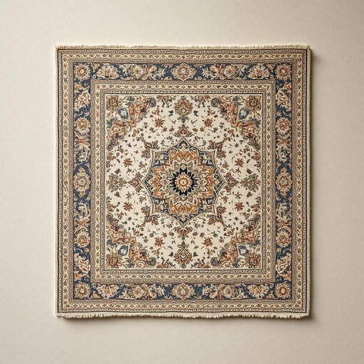

# rug

<h1 style="font-size: 2.5em; font-weight: 300; letter-spacing: 2px; margin: 0; color: #2c3e50;">
/rəg/
</h1>

---

---

## 例句

After the museum curator displayed the ancient artifact with meticulous care, the visitors were not only captivated by its intricate craftsmanship and historical significance but also moved by the profound stories it silently conveyed through generations.

*After(/ˈæftər/) the(/ðə/) museum(/mˈjuziəm/) curator(/ˈkjʊrətər/) displayed(/dɪˈspleɪd/) the(/ðə/) ancient(/ˈeɪnʧənt/) artifact(/ˈɑrtəˌfækt/) with(/wɪθ/) meticulous(/məˈtɪkjələs/) care,(/kɛr,/) the(/ðə/) visitors(/ˈvɪzɪtərz/) were(/wər/) not(/nɑt/) only(/ˈoʊnli/) captivated(/ˈkæptɪˌveɪtɪd/) by(/baɪ/) its(/ɪts/) intricate(/ˈɪntrəkət/) craftsmanship(/ˈkræftsmənˌʃɪp/) and(/ənd/) historical(/hɪˈstɔrɪkəl/) significance(/sɪgˈnɪfɪkəns/) but(/bət/) also(/ˈɔlsoʊ/) moved(/muvd/) by(/baɪ/) the(/ðə/) profound(/proʊˈfaʊnd/) stories(/ˈstɔriz/) it(/ɪt/) silently(/ˈsaɪləntli/) conveyed(/kənˈveɪd/) through(/θru/) generations.(/ˌʤɛnərˈeɪʃənz./)*

**翻译：** 博物馆馆长细心展示这件古代文物后，参观者不仅为其精致的工艺和深厚的历史意义所吸引，更被它代代相传、无声诉说的深远故事所感动。

---

## 解释

英语单词“rug”作为名词在家居生活用品的语境中，通常指较小面积的地毯或垫子，常用来覆盖房间、门厅、厨房或浴室的部分地面，以美化环境或提供舒适、防滑的作用。使用场合多为室内空间，如客厅中央放置的装饰性小地毯，或卧室门口的踏垫。学习者需要注意“rug”通常指比“carpet”（地毯，常指铺满整个房间的地面覆盖物）尺寸更小，不会铺满整个地面，因此语法上常与量词如“a rug”、“two rugs”连用，常见搭配包括“door rug”（门口垫）、“bathroom rug”（浴室垫）、“wool rug”（羊毛地毯）等。此外，“throw rug”指的是可随意铺抛的小地毯。词源方面，“rug”源于古北欧语“rugg”意为粗糙的布料，后引申为地毯或覆物，反映了其最初与织物质感相关的属性。在中文语境中，“rug”应译为“地毯”或“小地毯”，强调其不铺满整个房间且较小的特点，区别于大面积铺装的“地毯”或“地毯块”。“rug”作为词汇本身无褒贬含义，属于中性词，但在某些文化背景下，优质的手工编织“rug”可能被视为艺术品，具有一定的文化价值和装饰意义。

---

<small style="color: #999; font-size: 0.9em;">2025-07-27 09:14:04</small>

