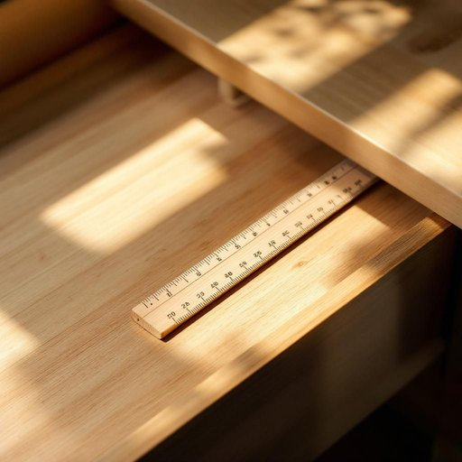

# ruler

<h1 style="font-size: 2.5em; font-weight: 300; letter-spacing: 2px; margin: 0; color: #2c3e50;">
/ˈrulər/
</h1>

---

---

## 例句

Could you please hand me the ruler that's tucked away in the drawer beneath the kitchen table, the one with the wooden finish and the slightly worn edges, because I need to measure the length of this shelf accurately before deciding where to place the new set of cookbooks?

*Could(/kʊd/) you(/ju/) please(/pliz/) hand(/hænd/) me(/mi/) the(/ðə/) ruler(/ˈrulər/) that's(/ðæts/) tucked(/təkt/) away(/əˈweɪ/) in(/ɪn/) the(/ðə/) drawer(/drɔr/) beneath(/bɪˈniθ/) the(/ðə/) kitchen(/ˈkɪʧən/) table,(/ˈteɪbəl,/) the(/ðə/) one(/wən/) with(/wɪθ/) the(/ðə/) wooden(/ˈwʊdən/) finish(/ˈfɪnɪʃ/) and(/ənd/) the(/ðə/) slightly(/sˈlaɪtli/) worn(/wɔrn/) edges,(/ˈɛʤɪz,/) because(/bɪˈkəz/) I(/aɪ/) need(/nid/) to(/tɪ/) measure(/ˈmɛʒər/) the(/ðə/) length(/lɛŋθ/) of(/əv/) this(/ðɪs/) shelf(/ʃɛlf/) accurately(/ˈækjərətli/) before(/ˌbiˈfɔr/) deciding(/ˌdɪˈsaɪdɪŋ/) where(/wɛr/) to(/tɪ/) place(/pleɪs/) the(/ðə/) new(/nu/) set(/sɛt/) of(/əv/) cookbooks?(/ˈkʊkˌbʊks?/)*

**翻译：** 你能把厨房桌子下面抽屉里那把带有木质纹理、边缘略显磨损的尺子递给我吗？因为我需要准确测量这层架子的长度，才能决定把新的一套烹饪书放在哪里。

---

## 解释

英语单词“ruler”在家居生活用品场景中作为名词，通常指的是一种用来测量长度或划线的直尺，这种工具多为塑料、木质或金属材质，常见于书桌、文具盒或书房中。具体使用场合多为绘图、学习、办公以及手工制作时测量物品长度或辅助画直线，语境自然且日常，适合学校、办公室或家庭等环境。英语学习者在使用“ruler”时需注意它是可数名词，常搭配量词如“a ruler”，以及与测量相关的动词“use a ruler（使用尺子）”、“measure with a ruler（用尺子测量）”等；此外，注意不要与“rule”（规则）混淆，它们拼写相近但含义不同。词源上，“ruler”源自中古英语“rulen”，进一步源自拉丁语“regula”，意指规矩、标准，引申为用以测量的工具，体现其原始“标准”的含义。在中文语境中，“ruler”准确翻译为“尺子”或“直尺”，强调其作为测量工具的属性，避免误解为统治者或管理者（另一个“ruler”的含义）。该词在家居生活用品领域无特殊褒贬色彩，属于中性词汇，使用时主要关注物理功能和形态，其文化内涵较少，更多体现实用价值。

---

<small style="color: #999; font-size: 0.9em;">2025-07-27 09:14:04</small>

