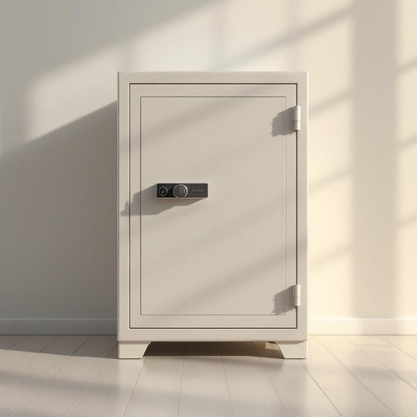

# safe

<h1 style="font-size: 2.5em; font-weight: 300; letter-spacing: 2px; margin: 0; color: #2c3e50;">
/seɪf/
</h1>

---

---

## 例句

The knowledge that was shared during the conference, which included groundbreaking research and innovative methodologies, revolutionized the way scientists approached climate change studies and inspired collaborative efforts across multiple disciplines.

*The(/ðə/) knowledge(/ˈnɑlɪʤ/) that(/ðət/) was(/wɑz/) shared(/ʃɛrd/) during(/ˈdʊrɪŋ/) the(/ðə/) conference,(/ˈkɑnfərəns,/) which(/wɪʧ/) included(/ˌɪnˈkludɪd/) groundbreaking(/ˈgraʊnˌbreɪkɪŋ/) research(/ˈrisərʧ/) and(/ənd/) innovative(/ˈɪnəˌveɪtɪv/) methodologies,(/ˌmɛθoʊˈdɑləʤiz,/) revolutionized(/ˌrɛvəˈluʃəˌnaɪzd/) the(/ðə/) way(/weɪ/) scientists(/ˈsaɪəntɪsts/) approached(/əˈproʊʧt/) climate(/ˈklaɪmɪt/) change(/ʧeɪnʤ/) studies(/ˈstədiz/) and(/ənd/) inspired(/ˌɪnˈspaɪərd/) collaborative(/kəˈlæbərˌeɪtɪv/) efforts(/ˈɛfərts/) across(/əˈkrɔs/) multiple(/ˈməltəpəl/) disciplines.(/ˈdɪsəplənz./)*

**翻译：** 会议期间分享的知识，包括开创性的研究成果和创新的方法论，彻底改变了科学家们研究气候变化的方式，并激发了跨多个学科的合作努力。

---

## 解释

英语单词"safe"作为名词时，在家居生活用品的语境中通常指的是“保险箱”或“保险柜”，即一种用于存放贵重物品、现金或重要文件的防盗容器。具体使用场合多见于家庭或办公室环境，当人们需要保护重要物品免受盗窃或火灾等损害时，会提到“put something in the safe”（把某物放进保险箱）或“open the safe”（打开保险柜）等表达。英语学习者使用这个名词时应注意其不可数与可数用法的区别，safe作为名词通常为可数名词，复数形式为safes，且常见搭配有“a fireproof safe”（防火保险箱）、“a small safe”（小型保险柜）等。此外，该词还常搭配动词如“lock the safe”（锁上保险柜）、“crack the safe”（撬开保险柜）等表达，掌握这些搭配有助于更自然地使用。词源方面，"safe"源自拉丁语“salvus”，意为“安全、无恙”，从形容词演变为名词用以指代能保证安全的储存工具，这种转变反映出物品保护功能的文化需求。中文语境中，“safe”作为名词应准确翻译为“保险箱”或“保险柜”，避免直接音译或误解为形容词“安全的”。在使用时需注意，它通常带有实物属性，不具备褒贬色彩，而更多体现一种功能性的安全保障，文化上强调对个人或家庭财产的保护意识，体现出对安全和隐私的重视。

---

<small style="color: #999; font-size: 0.9em;">2025-07-27 09:14:04</small>

