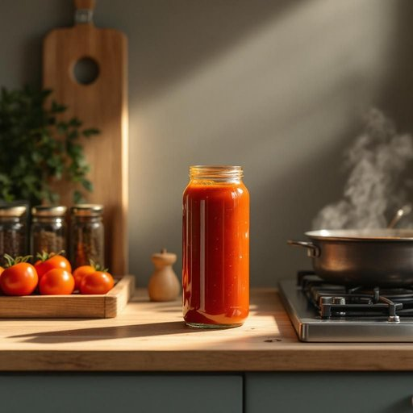

# sauce

<h1 style="font-size: 2.5em; font-weight: 300; letter-spacing: 2px; margin: 0; color: #2c3e50;">
/sɔs/
</h1>

---

---

## 例句

Could you please pass me the tomato sauce that's in the cupboard next to the spice rack, as I need it to add a bit of flavour to the stew I'm making, which has been simmering on the stove for over an hour?

*Could(/kʊd/) you(/ju/) please(/pliz/) pass(/pæs/) me(/mi/) the(/ðə/) tomato(/təˈmɑˌtoʊ/) sauce(/sɔs/) that's(/ðæts/) in(/ɪn/) the(/ðə/) cupboard(/ˈkəbərd/) next(/nɛkst/) to(/tɪ/) the(/ðə/) spice(/spaɪs/) rack,(/ræk,/) as(/ɛz/) I(/aɪ/) need(/nid/) it(/ɪt/) to(/tɪ/) add(/æd/) a(/ə/) bit(/bɪt/) of(/əv/) flavour(/flavour*/) to(/tɪ/) the(/ðə/) stew(/stu/) I'm(/əm/) making,(/ˈmeɪkɪŋ,/) which(/wɪʧ/) has(/həz/) been(/bɪn/) simmering(/ˈsɪmərɪŋ/) on(/ɔn/) the(/ðə/) stove(/stoʊv/) for(/fər/) over(/ˈoʊvər/) an(/ən/) hour?(/aʊər?/)*

**翻译：** 请把放在调料架旁边橱柜里的番茄酱递给我好吗？我需要它为我正在炖的菜增添风味，这锅菜已经在炉子上慢炖了一个多小时。

---

## 解释

英语单词'sauce'在家居生活用品场景中作为名词，通常指用于调味的各种液态或半液态调料，如番茄酱、烧烤酱、酱汁等，主要出现在烹饪、餐饮和厨房用具等语境中，使用时多与食物名称搭配，如tomato sauce（番茄酱）、soy sauce（酱油）、hot sauce（辣酱）等。英语学习者在使用时需注意'sauce'为可数名词，一般在表示具体种类时用复数形式sauces，且常用作修饰语或被修饰语，例如“a bottle of sauce”（一瓶酱料）或“serve with sauce”（配以酱汁）。此外，常见搭配如“dipping sauce”（蘸料）、“cream sauce”（奶油酱）等，表达时应关注搭配的准确性以体现细节。词源上，'sauce'源自拉丁语‘salsus’，意为“盐渍的、加盐的”，经过法语传入英语，最初泛指任何调味液，到现代特指烹调用酱汁。在中文语境中，'sauce'一般译为“酱”、“酱汁”或“调味酱”，具体意义取决于上下文，需区分“酱油”、“番茄酱”等具体品种。该词本身无褒贬色彩，但在俚语或幽默语境中有时含有“无礼、鲁莽”的暗示，但在家居生活词义范围内无此类语言色彩，主要指日常调味品。

---

<small style="color: #999; font-size: 0.9em;">2025-07-27 09:14:04</small>

