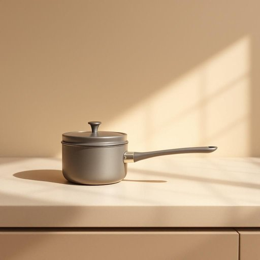

# saucepan

<h1 style="font-size: 2.5em; font-weight: 300; letter-spacing: 2px; margin: 0; color: #2c3e50;">
/ˈsɔˌspæn/
</h1>

---

---

## 例句

After the complex analysis of the data, the scientist concluded that the hypothesis was supported by the evidence despite some unexpected variables that required further investigation.

*After(/ˈæftər/) the(/ðə/) complex(/ˈkɑmplɛks/) analysis(/æˈnælɪsɪs/) of(/əv/) the(/ðə/) data,(/ˈdætə,/) the(/ðə/) scientist(/ˈsaɪəntɪst/) concluded(/kənˈkludɪd/) that(/ðət/) the(/ðə/) hypothesis(/haɪˈpɑθəsəs/) was(/wɑz/) supported(/səˈpɔrtɪd/) by(/baɪ/) the(/ðə/) evidence(/ˈɛvədəns/) despite(/dɪˈspaɪt/) some(/səm/) unexpected(/ˌənɪkˈspɛktɪd/) variables(/ˈvɛriəbəlz/) that(/ðət/) required(/rikˈwaɪərd/) further(/ˈfərðər/) investigation.(/ˌɪnˌvɛstəˈgeɪʃən./)*

**翻译：** 经过对数据的深入分析，科学家得出结论：尽管存在一些需进一步研究的意外变量，证据仍然支持该假设。

---

## 解释

英语单词"saucepan"作为名词，指的是一种带有长柄和盖子的小型深锅，常用于烹饪中加热或烹煮液体食物，如酱汁、汤或煮沸水，主要出现在厨房家居生活场景中。在具体使用中，"saucepan"通常搭配动词如“boil”、“heat”、“cook”，“put on the stove”等，常见表达还有"small saucepan"（小号炖锅）、"heavy saucepan"（厚底炖锅）等，英语学习者需要注意的是该词是可数名词，复数形式为"saucepans"，在句中一般作为具体物品出现，且通常与表示烹饪动作的动词连用，用来描述烹饪器具的用途或数量。此外，"saucepan"常用于家庭厨房谈话中，没有特殊的褒贬色彩，语义中性，纯粹指一种实用器具。词源上，"saucepan"由"sauce"（酱汁）和"pan"（平底锅、锅）的复合构词法形成，起源于中世纪英语，反映其最初设计用于加热酱汁的功能。在中文语境中，"saucepan"准确翻译为“炖锅”或“小汤锅”，突出其带柄、适合炖煮液体的特点，区别于平底煎锅或大锅，理解时应侧重于其在家庭厨房中用于烹调液体食材的专用炊具属性，无任何特殊文化内涵。

---

<small style="color: #999; font-size: 0.9em;">2025-07-27 09:14:04</small>

