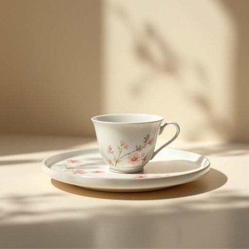

# saucer

<h1 style="font-size: 2.5em; font-weight: 300; letter-spacing: 2px; margin: 0; color: #2c3e50;">
/ˈsɔsər/
</h1>

---

---

## 例句

The saucer on which the exquisite porcelain teacup rested was adorned with intricate patterns that shimmered under the soft afternoon light, creating a delicate complement to the entire tea set.

*The(/ðə/) saucer(/ˈsɔsər/) on(/ɔn/) which(/wɪʧ/) the(/ðə/) exquisite(/ˈɛkskwəzət/) porcelain(/ˈpɔrsələn/) teacup(/ˈtiˌkəp/) rested(/ˈrɛstɪd/) was(/wɑz/) adorned(/əˈdɔrnd/) with(/wɪθ/) intricate(/ˈɪntrəkət/) patterns(/ˈpætərnz/) that(/ðət/) shimmered(/ˈʃɪmərd/) under(/ˈəndər/) the(/ðə/) soft(/sɔft/) afternoon(/ˌæftərˈnun/) light,(/laɪt,/) creating(/kriˈeɪtɪŋ/) a(/ə/) delicate(/ˈdɛləkət/) complement(/ˈkɑmpləmənt/) to(/tɪ/) the(/ðə/) entire(/ɪnˈtaɪər/) tea(/ti/) set.(/sɛt./)*

**翻译：** 盛放精致瓷杯的茶托上装饰着复杂精美的纹样，在柔和的午后光线下熠熠生辉，与整套餐具相得益彰，尽显雅致。

---

## 解释

英语单词'saucer'作为名词在家居生活用品场景中，指的是用来盛放茶杯或咖啡杯底部的小盘子，通常较浅且圆形，常见于茶具或咖啡具套装中，主要功能是接住杯子滴落的液体或用来放置茶匙。使用时通常出现在饮茶、咖啡饮用的语境，如“a cup and saucer”（一套杯碟）或“put the cup back on the saucer”（把杯子放回碟子上），英语学习者需要注意‘saucer’是可数名词，复数形式为‘saucers’，且一般与表示饮品的词如’cup’、’tea’、’coffee’搭配。此外，习惯表达如“tea cup and saucer”是日常生活中常见的搭配，需要掌握固定搭配。词源上，‘saucer’源自中古法语’saucier’，源自拉丁语’sallicaria’，意为盛酱汁的小碟，后来演变为茶杯碟，反映了其作为盛放物品的小盘子的本质。中文语境中，“saucer”常准确翻译为“茶托”或“茶碟”，强调它作为茶杯底下的托盘作用，没有贬义或特殊褒义，属于普通的家庭餐具用语。但需注意在中国传统饮茶文化中，虽然有茶托的概念，但与西方‘saucer’在形状和使用习惯上略有不同，因此理解时应结合具体文化背景。

---

<small style="color: #999; font-size: 0.9em;">2025-07-27 09:14:04</small>

