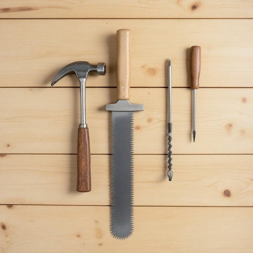

# saw

<h1 style="font-size: 2.5em; font-weight: 300; letter-spacing: 2px; margin: 0; color: #2c3e50;">
/sɔ/
</h1>

---

---

## 例句

Could you please pass me the saw that’s hanging next to the hammer and the screwdriver on the shed wall, because I need to cut these wooden planks precisely before we start assembling the new shelves for the living room?

*Could(/kʊd/) you(/ju/) please(/pliz/) pass(/pæs/) me(/mi/) the(/ðə/) saw(/sɔ/) that’s(/that’s*/) hanging(/ˈhæŋɪŋ/) next(/nɛkst/) to(/tɪ/) the(/ðə/) hammer(/ˈhæmər/) and(/ənd/) the(/ðə/) screwdriver(/ˈskruˌdraɪvər/) on(/ɔn/) the(/ðə/) shed(/ʃɛd/) wall,(/wɔl,/) because(/bɪˈkəz/) I(/aɪ/) need(/nid/) to(/tɪ/) cut(/kət/) these(/ðiz/) wooden(/ˈwʊdən/) planks(/plæŋks/) precisely(/prɪˈsaɪsli/) before(/ˌbiˈfɔr/) we(/wi/) start(/stɑrt/) assembling(/əˈsɛmbəlɪŋ/) the(/ðə/) new(/nu/) shelves(/ʃɛlvz/) for(/fər/) the(/ðə/) living(/ˈlɪvɪŋ/) room?(/rum?/)*

**翻译：** 能否请你把棚屋墙上挂在锤子和螺丝刀旁边的锯子递给我？我需要在开始组装客厅的新书架之前，先把这些木板精确地锯好。

---

## 解释

英语单词“saw”作为名词时，主要指一种用于切割木材、金属或其他坚硬材料的工具，通常由带有锯齿的金属片组成，并配有手柄，使用时通过往复运动来完成切割工作。在家居生活用品的场景中，“saw”常见于描述各种手锯、电锯等工具，如“hand saw”（手锯）、“jigsaw”（拼图锯）、“circular saw”（圆锯）等，使用场合多为家庭装修、木工制作或园艺修剪等实际操作时。对于学习者来说，作为名词的“saw”通常为单数形式，复数为“saws”，需要注意区分动词“saw”（锯）和名词“saw”（锯子）在句子中的不同词性和作用，且常与具体的形容词或工具类别搭配，如“a sharp saw”、“a power saw”，表达更明确。词源方面，“saw”源于古英语“sagu”，可追溯到更早的日耳曼语根，反映了该工具在手工制造和建筑中的悠久历史。在中文语境中，“saw”准确翻译为“锯子”或简称“锯”，是一种常见的手工工具名称，无特殊褒贬或文化内涵，属于中性词汇，使用时多指物理工具本身，传递的是实用性质的概念。

---

<small style="color: #999; font-size: 0.9em;">2025-07-27 09:14:04</small>

