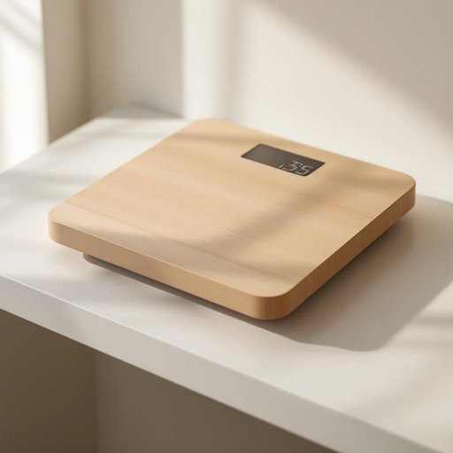

# scale

<h1 style="font-size: 2.5em; font-weight: 300; letter-spacing: 2px; margin: 0; color: #2c3e50;">
/skeɪl/
</h1>

---

---

## 例句

The escalating deforestation has reached a scale that threatens the biodiversity of entire ecosystems, prompting scientists to call for immediate global action to mitigate irreversible damage.

*The(/ðə/) escalating(/ˈɛskəˌleɪtɪŋ/) deforestation(/dɪˌfɔrɪˈsteɪʃən/) has(/həz/) reached(/riʧt/) a(/ə/) scale(/skeɪl/) that(/ðət/) threatens(/θˈrɛtənz/) the(/ðə/) biodiversity(/ˌbaɪoʊdaɪˈvərsəti/) of(/əv/) entire(/ɪnˈtaɪər/) ecosystems,(/ˈikoʊˌsɪstəmz,/) prompting(/ˈprɑmptɪŋ/) scientists(/ˈsaɪəntɪsts/) to(/tɪ/) call(/kɔl/) for(/fər/) immediate(/ˌɪˈmiˌdiət/) global(/ˈgloʊbəl/) action(/ˈækʃən/) to(/tɪ/) mitigate(/ˈmɪtəˌgeɪt/) irreversible(/ˌɪrɪˈvərsəbəl/) damage.(/ˈdæmɪʤ./)*

**翻译：** 日益加剧的森林砍伐已经达到威胁整个生态系统生物多样性的程度，促使科学家呼吁立即采取全球行动，以减缓不可逆转的破坏。

---

## 解释

在家居生活用品的语境中，英语单词“scale”作为名词主要指“秤”或“称重器”，如厨房秤、体重秤等，具体使用场合常见于称量食材重量、测量人体体重等情景，表达时如“kitchen scale”（厨房秤）、“bathroom scale”（体重秤）。学习者需注意“scale”作为名词时通常不可数或可数，具体指秤时是可数名词，可用复数形式“scales”，但在泛指结垢的“水垢”“石灰垢”时也称为“scale”，此时通常不可数。此外，“scale”的常见搭配还包括“weighing scale”（称重秤）、“digital scale”（电子秤）等，表达时需结合具体家居用品情境准确使用。词源上，“scale”来自拉丁语“scala”，意为“阶梯、梯子”，引申出测量、刻度的概念，最终扩展至各种测量工具或刻度系统，家居生活中的“秤”即源于其测量功能的引申。中文语境中，“scale”翻译为“秤”时，指的是日常生活中用于测量重量的器具，准确理解需根据具体语境区分，如同时“scale”也指“水垢”等结垢物，属于不同含义；在褒贬色彩方面，作为“秤”本身无明显褒贬，作为“scale”指水垢时则带有一定负面含义，表示需要清理和维护的卫生问题，整体上该词在家居生活用品领域属于中性实用词汇，用法广泛且频率较高。

---

<small style="color: #999; font-size: 0.9em;">2025-07-27 09:14:04</small>

