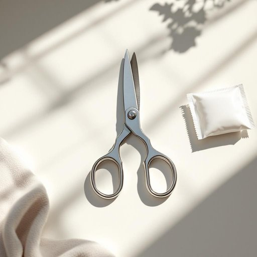

# scissors

<h1 style="font-size: 2.5em; font-weight: 300; letter-spacing: 2px; margin: 0; color: #2c3e50;">
/ˈsɪzərz/
</h1>

---

---

## 例句

Could you please pass me the scissors that are lying on the kitchen counter next to the unopened parcel, as I need to carefully cut through the tape without damaging the contents inside?

*Could(/kʊd/) you(/ju/) please(/pliz/) pass(/pæs/) me(/mi/) the(/ðə/) scissors(/ˈsɪzərz/) that(/ðət/) are(/ər/) lying(/laɪɪŋ/) on(/ɔn/) the(/ðə/) kitchen(/ˈkɪʧən/) counter(/ˈkaʊntər/) next(/nɛkst/) to(/tɪ/) the(/ðə/) unopened(/əˈnoʊpənd/) parcel,(/ˈpɑrsəl,/) as(/ɛz/) I(/aɪ/) need(/nid/) to(/tɪ/) carefully(/ˈkɛrfəli/) cut(/kət/) through(/θru/) the(/ðə/) tape(/teɪp/) without(/wɪˈθaʊt/) damaging(/ˈdæmɪʤɪŋ/) the(/ðə/) contents(/ˈkɑntɛnts/) inside?(/ˌɪnˈsaɪd?/)*

**翻译：** 麻烦您把放在厨房台面上、未开封包裹旁边的剪刀递给我，我需要小心地沿着胶带剪开，以免损坏里面的物品。

---

## 解释

英语单词“scissors”作为名词，在家居生活用品场景中指一种用于剪切纸张、布料等物品的工具，通常由两片金属刀片通过铆钉连接成能够相互开合的结构，配有一个或两个手柄。具体使用场合包括在家里做手工、裁剪服装或办公环境中裁纸等，属于日常生活中常见且实用的工具。语法上，“scissors”通常用作复数名词，即使指单把剪刀也不使用单数形式“scissor”，这点是英语学习者需要特别注意的，因此谓语动词多用复数形式，如“the scissors are on the table”；此外，常见搭配包括“a pair of scissors”，这是最标准且常用的表达，因为“scissors”本身就是复数形态。关于词源，“scissors”起源于拉丁语“cisoria”，意为“切割工具”，经古法语传入英语，反映了其作为切割工具的本质功能。在中文语境中，“scissors”准确翻译为“剪刀”，既具体又精确，指的是两片刀片通过铰链连接的手工工具，无特殊褒贬含义，仅作为日常生活用品出现。文化层面上，剪刀在许多文化中象征剪断和变化，有时具象征意义，但在普通家居语境中，此词语义纯粹实用，无特别的情感色彩或文化内涵。

---

<small style="color: #999; font-size: 0.9em;">2025-07-27 09:14:04</small>

