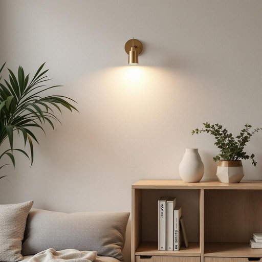

# sconce

<h1 style="font-size: 2.5em; font-weight: 300; letter-spacing: 2px; margin: 0; color: #2c3e50;">
/skɑns/
</h1>

---

---

## 例句

In the cosy living room, where the antique wooden shelves were filled with well-worn books and the scent of lavender lingered in the air, she carefully adjusted the brass sconce on the wall, which, despite its ornate Victorian design and slightly tarnished finish, cast a warm, flickering glow that transformed the entire space into a haven of comfort and relaxation.

*In(/ɪn/) the(/ðə/) cosy(/ˈkoʊzi/) living(/ˈlɪvɪŋ/) room,(/rum,/) where(/wɛr/) the(/ðə/) antique(/ænˈtik/) wooden(/ˈwʊdən/) shelves(/ʃɛlvz/) were(/wər/) filled(/fɪld/) with(/wɪθ/) well-worn(/well-worn*/) books(/bʊks/) and(/ənd/) the(/ðə/) scent(/sɛnt/) of(/əv/) lavender(/ˈlævəndər/) lingered(/ˈlɪŋgərd/) in(/ɪn/) the(/ðə/) air,(/ɛr,/) she(/ʃi/) carefully(/ˈkɛrfəli/) adjusted(/əˈʤəstɪd/) the(/ðə/) brass(/bræs/) sconce(/skɑns/) on(/ɔn/) the(/ðə/) wall,(/wɔl,/) which,(/wɪʧ,/) despite(/dɪˈspaɪt/) its(/ɪts/) ornate(/ɔrˈneɪt/) Victorian(/vɪkˈtɔriən/) design(/dɪˈzaɪn/) and(/ənd/) slightly(/sˈlaɪtli/) tarnished(/ˈtɑrnɪʃt/) finish,(/ˈfɪnɪʃ,/) cast(/kæst/) a(/ə/) warm,(/wɔrm,/) flickering(/ˈflɪkərɪŋ/) glow(/gloʊ/) that(/ðət/) transformed(/trænsˈfɔrmd/) the(/ðə/) entire(/ɪnˈtaɪər/) space(/speɪs/) into(/ˈɪntu/) a(/ə/) haven(/ˈheɪvən/) of(/əv/) comfort(/ˈkəmfərt/) and(/ənd/) relaxation.(/ˌrilækˈseɪʃən./)*

**翻译：** 在那个温馨的客厅里，古旧的木质书架上摆满了翻阅多次的书籍，空气中弥漫着淡淡的薰衣草香气。她小心翼翼地调整着墙上的黄铜壁灯，尽管其华丽的维多利亚式设计略显斑驳，却散发出温暖而闪烁的光芒，将整个空间转变成一个舒适惬意的避风港。

---

## 解释

英语单词sconce作为名词，在家居生活用品场景中通常指安装在墙上的灯座或壁灯罩，主要用于固定和保护蜡烛、油灯或现代电灯泡，常见于走廊、客厅或卧室的墙壁上，起到照明和装饰的双重作用。使用时，学习者需注意sconce一般是单数形式，复数形式为sconces，且多用作可数名词；常见搭配包括wall sconce（壁灯）、candle sconce（烛台壁灯）等，表达时通常置于具体灯具前或后以说明其形态或功能。词源方面，sconce源自中古英语，进一步来源于古法语sconce，意为防御工事或壁垒，暗示其最初作为保护性结构的含义，后来引申为覆盖物或固定装置。中文中sconce准确翻译为“壁灯座”或“壁灯罩”，强调其固定于墙面以支撑及保护光源的功能。在文化上，sconce多带有复古、典雅的氛围，常见于传统或古典风格的室内装饰中，无明显褒贬含义，但使用时常与营造温馨、古典、历史感的环境相关联。

---

<small style="color: #999; font-size: 0.9em;">2025-07-27 09:14:04</small>

