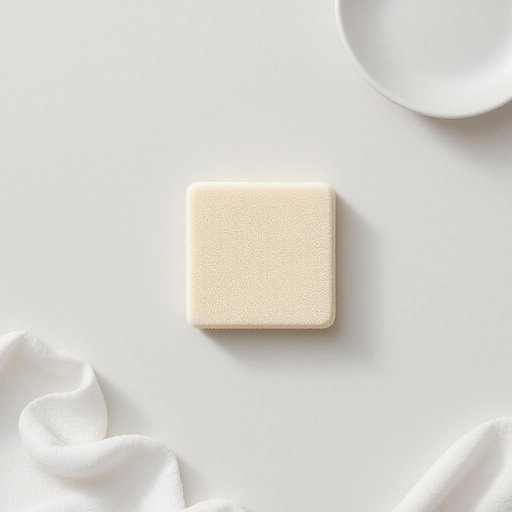

# scourer

<h1 style="font-size: 2.5em; font-weight: 300; letter-spacing: 2px; margin: 0; color: #2c3e50;">
/scourer*/
</h1>

---

---

## 例句

Before you start scrubbing the stubborn grease off the oven racks, make sure you have a reliable scourer at hand, preferably one that balances abrasiveness and durability, so that it can effectively remove burnt-on residues without scratching the metal surface.

*Before(/ˌbiˈfɔr/) you(/ju/) start(/stɑrt/) scrubbing(/ˈskrəbɪŋ/) the(/ðə/) stubborn(/ˈstəbərn/) grease(/gris/) off(/ɔf/) the(/ðə/) oven(/ˈəvən/) racks,(/ræks,/) make(/meɪk/) sure(/ʃʊr/) you(/ju/) have(/hæv/) a(/ə/) reliable(/rɪˈlaɪəbəl/) scourer(/scourer*/) at(/æt/) hand,(/hænd,/) preferably(/ˈprɛfərəbli/) one(/wən/) that(/ðət/) balances(/ˈbælənsɪz/) abrasiveness(/abrasiveness*/) and(/ənd/) durability,(/dərəˈbɪlɪti,/) so(/soʊ/) that(/ðət/) it(/ɪt/) can(/kən/) effectively(/ˈifɛktɪvli/) remove(/riˈmuv/) burnt-on(/burnt-on*/) residues(/ˈrɛzəˌduz/) without(/wɪˈθaʊt/) scratching(/ˈskræʧɪŋ/) the(/ðə/) metal(/ˈmɛtəl/) surface.(/ˈsərfəs./)*

**翻译：** 在开始擦除烤箱架上顽固的油脂之前，确保手边有一块可靠的刷子，最好是那种兼顾去污力和耐用性的刷子，这样才能有效去除烧焦的残留物，同时不刮伤金属表面。

---

## 解释

英语单词'scourer'作为名词，在家居生活用品的语境中通常指用于清洁和擦洗顽固污渍的工具，比如钢丝球、擦锅刷或其他粗糙材质的清洁用具，常见于厨房或浴室的清洁场合。英语学习者使用该词时应注意，'scourer'作为可数名词，表示具体的清洁器具，常与介词短语连用，如"a metal scourer"（金属擦洗器），或与动词搭配如"use a scourer to clean"（用擦洗器清洁），此外，'scour'作为动词意为“擦洗、擦净”，其名词形式'scourer'通常指专门的清洁工具。词源上，'scourer'来源于动词'scour'，这个词源自中古英语，最初与擦洗或冲刷有关，反映了去除污渍的动作本质。在中文语境中，'scourer'一般译为“擦洗器”、“擦锅刷”或“钢丝球”等，根据具体材质和用途有所区别，含义准确指向清洁用品，没有褒贬色彩，但在实际使用时需注意其多为粗糙质地，适合强力去污，使用时避免损坏细腻表面。从文化角度看，'scourer'在西方家居中是常见的日用品，体现了家庭清洁中的实用工具，没有特殊的文化隐喻，仅强调其功能性和实用性。

---

<small style="color: #999; font-size: 0.9em;">2025-07-27 09:14:04</small>

