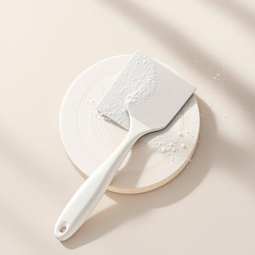

# scraper

<h1 style="font-size: 2.5em; font-weight: 300; letter-spacing: 2px; margin: 0; color: #2c3e50;">
/ˈskreɪpər/
</h1>

---

---

## 例句

Before you start repainting the kitchen tiles, make sure to use the scraper that’s been sitting in the cleaning cupboard for ages, because it’s perfect for removing old adhesive residues and grime without damaging the surface beneath.

*Before(/ˌbiˈfɔr/) you(/ju/) start(/stɑrt/) repainting(/riˈpeɪntɪŋ/) the(/ðə/) kitchen(/ˈkɪʧən/) tiles,(/taɪlz,/) make(/meɪk/) sure(/ʃʊr/) to(/tɪ/) use(/juz/) the(/ðə/) scraper(/ˈskreɪpər/) that’s(/that’s*/) been(/bɪn/) sitting(/ˈsɪtɪŋ/) in(/ɪn/) the(/ðə/) cleaning(/ˈklinɪŋ/) cupboard(/ˈkəbərd/) for(/fər/) ages,(/ˈeɪʤɪz,/) because(/bɪˈkəz/) it’s(/it’s*/) perfect(/ˈpərˌfɪkt/) for(/fər/) removing(/riˈmuvɪŋ/) old(/oʊld/) adhesive(/əˈdhisɪv/) residues(/ˈrɛzəˌduz/) and(/ənd/) grime(/graɪm/) without(/wɪˈθaʊt/) damaging(/ˈdæmɪʤɪŋ/) the(/ðə/) surface(/ˈsərfəs/) beneath.(/bɪˈniθ./)*

**翻译：** 在开始重新粉刷厨房瓷砖之前，务必使用那个在清洁柜里放了很久的刮刀，因为它非常适合去除旧的胶粘残留物和污垢，同时不会损伤底层表面。

---

## 解释

英语单词“scraper”在家居生活用品场景中作为名词，通常指用来刮除表面污渍、食物残渣、油漆或其他附着物的刮刀、刮板或铲子，常见于厨房用具或清洁工具中。具体使用场合包括厨房清理食物残渣时用的锅底刮刀、去除灶台污垢的刮板，甚至用于清理窗户、地板或家具表面的硬质刮具。在语法上，“scraper”作为可数名词，通常与表示用途的短语搭配，如“paint scraper”（油漆刮刀）、“food scraper”（食物刮刀）、“window scraper”（窗户刮刀），学习者应注意它常用于具体现象的物品名称，其复数形式为“scrapers”，并且可以与介词短语搭配描述用途或材质，比如“a metal scraper for cleaning the stove”。词源上，“scraper”源自动词“scrape”，意为“刮擦、刮去”，加上表示“人或物”的后缀“-er”，表示“用来刮的工具”，这一构词法符合英语中动词派生名词的常见规律。在中文语境中，“scraper”准确翻译多为“刮刀”、“刮板”或“铲刀”，视具体用途和形状而定，强调其功能性工具属性。需要注意的是，“scraper”在家居用品中一般无贬义，属于中性词，但在其他语境中，如“city scraper”可引申为摩天大楼（skyscraper），或者在口语中表示刮钱者有轻微贬义，因此学习者应结合语境理解。在家居生活中使用该词时，应注重其具体清洁或刮除作用，避免混淆其其他词义。

---

<small style="color: #999; font-size: 0.9em;">2025-07-27 09:14:04</small>

