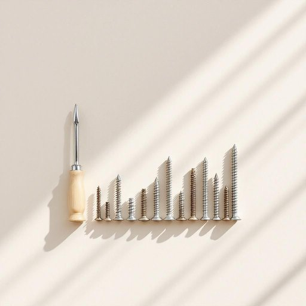

# screw

<h1 style="font-size: 2.5em; font-weight: 300; letter-spacing: 2px; margin: 0; color: #2c3e50;">
/skru/
</h1>

---

---

## 例句

Before you start assembling the new bookshelf, make sure you have all the screws sorted by size and type, because using the wrong screw could not only damage the wood but also compromise the stability of the entire structure once it's fully built.

*Before(/ˌbiˈfɔr/) you(/ju/) start(/stɑrt/) assembling(/əˈsɛmbəlɪŋ/) the(/ðə/) new(/nu/) bookshelf,(/ˈbʊkˌʃɛlf,/) make(/meɪk/) sure(/ʃʊr/) you(/ju/) have(/hæv/) all(/ɔl/) the(/ðə/) screws(/skruz/) sorted(/ˈsɔrtɪd/) by(/baɪ/) size(/saɪz/) and(/ənd/) type,(/taɪp,/) because(/bɪˈkəz/) using(/ˈjuzɪŋ/) the(/ðə/) wrong(/rɔŋ/) screw(/skru/) could(/kʊd/) not(/nɑt/) only(/ˈoʊnli/) damage(/ˈdæmɪʤ/) the(/ðə/) wood(/wʊd/) but(/bət/) also(/ˈɔlsoʊ/) compromise(/ˈkɑmprəˌmaɪz/) the(/ðə/) stability(/stəˈbɪlɪti/) of(/əv/) the(/ðə/) entire(/ɪnˈtaɪər/) structure(/ˈstrəkʧər/) once(/wəns/) it's(/ɪts/) fully(/ˈfʊli/) built.(/bɪlt./)*

**翻译：** 在开始组装新书架之前，请确保已将所有螺丝按尺寸和类型分类，因为使用错误的螺丝不仅可能损坏木材，还会在书架组装完成后影响整体结构的稳固性。

---

## 解释

英语单词screw作为名词在家居生活用品的语境中，通常指的是一种带螺纹的金属小物件，用于将物体固定在一起，比如家具组装、墙面挂钩安装或修理电器时常见。具体使用场合多见于DIY、修理和组装说明中，如a screw for the shelf（用于架子的螺丝）或tighten the screw（拧紧螺丝）。英语学习者在使用该词时需要注意screw作为可数名词时单复数形式为screws，且其前常可搭配定冠词、数量词或形容词，如two screws，a loose screw，此外，固定搭配a screw driver（螺丝刀）较常见。语法上，screw一般用作具体物品，不用于抽象意义，且不可与不可数名词混淆。词源上，screw源自中古英语，来自古法语escroue，进而源自拉丁语scrobs，意指螺旋状物，反映其结构特征。中文语境中screw准确翻译为螺丝或螺钉，强调其机械连接和固定功能，无明显褒贬色彩，但需注意与螺栓区分，后者通常较大且配合螺母使用。此外，日常口语中screw作为动词或俚语有其他含义，但在家居用品语境下通常只指螺丝，避免误用。综上，screw在家居物品领域指代固定用的螺纹紧固件，使用时注重数量表达和搭配词汇，正确理解其机械属性及词源有助于更精准掌握该词。

---

<small style="color: #999; font-size: 0.9em;">2025-07-27 09:14:04</small>

