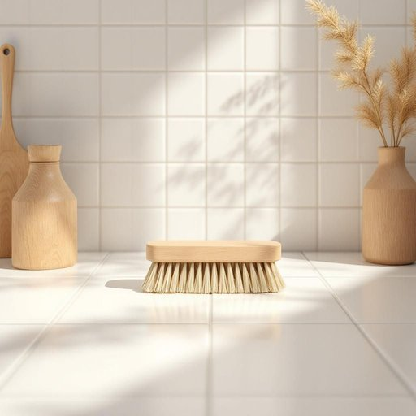

# scrubber

<h1 style="font-size: 2.5em; font-weight: 300; letter-spacing: 2px; margin: 0; color: #2c3e50;">
/ˈskrəbər/
</h1>

---

---

## 例句

Before you start washing the stubborn stains off the tiles, make sure to grab the scrubber with the firm bristles that we bought last week, as it not only cleans more effectively than a regular sponge but also helps prevent damage to the grout, which, if neglected, can become a breeding ground for mould.

*Before(/ˌbiˈfɔr/) you(/ju/) start(/stɑrt/) washing(/ˈwɑʃɪŋ/) the(/ðə/) stubborn(/ˈstəbərn/) stains(/steɪnz/) off(/ɔf/) the(/ðə/) tiles,(/taɪlz,/) make(/meɪk/) sure(/ʃʊr/) to(/tɪ/) grab(/græb/) the(/ðə/) scrubber(/ˈskrəbər/) with(/wɪθ/) the(/ðə/) firm(/fərm/) bristles(/ˈbrɪsəlz/) that(/ðət/) we(/wi/) bought(/bɔt/) last(/læst/) week,(/wik,/) as(/ɛz/) it(/ɪt/) not(/nɑt/) only(/ˈoʊnli/) cleans(/klinz/) more(/mɔr/) effectively(/ˈifɛktɪvli/) than(/ðən/) a(/ə/) regular(/ˈrɛgjələr/) sponge(/spənʤ/) but(/bət/) also(/ˈɔlsoʊ/) helps(/hɛlps/) prevent(/prɪˈvɛnt/) damage(/ˈdæmɪʤ/) to(/tɪ/) the(/ðə/) grout,(/graʊt,/) which,(/wɪʧ,/) if(/ɪf/) neglected,(/nɪˈglɛktɪd,/) can(/kən/) become(/bɪˈkəm/) a(/ə/) breeding(/ˈbridɪŋ/) ground(/graʊnd/) for(/fər/) mould.(/moʊld./)*

**翻译：** 在开始清洗瓷砖上的顽固污渍之前，务必先拿起我们上周购买的那把硬毛刷子，因为它不仅比普通海绵更有效清洁，还能帮助防止灌浆处受损，而灌浆一旦被忽视，便可能成为霉菌滋生的温床。

---

## 解释

英语单词“scrubber”在家居生活用品语境中作为名词，主要指用于清洁物体表面尤其是厨房或浴室等环境的擦洗工具，如洗碗刷、擦洗垫或刷子等，具体使用场合通常是指那些需要用力擦洗以去除污渍、油渍或顽固污垢的场合，如洗碗、擦洗水池、浴缸、瓷砖等表面，英语学习者在使用“scrubber”时需注意它是可数名词，常用复数形式“scrubbers”，并常与动词“use”、“clean”等搭配，如“use a scrubber to clean the sink”，常见表达还有“scouring scrubber”指带有磨砂效果的擦洗工具，词源方面，“scrubber”源自动词“scrub”，意为“擦洗、刷洗”，加上名词后缀“-er”表示“执行擦洗动作的物品”，其起源与日常清洁活动密切相关，在中文语境中，“scrubber”最准确的翻译为“擦洗器”或“擦洗刷”，根据具体物品可译为“刷子”或“擦洗垫”，此词语本身无褒贬色彩和特殊文化内涵，属于中性词汇，强调实用和功能性，适合描述各种家庭清洁用品。

---

<small style="color: #999; font-size: 0.9em;">2025-07-27 09:14:04</small>

