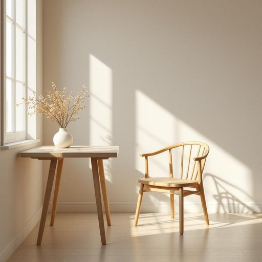

# seat

<h1 style="font-size: 2.5em; font-weight: 300; letter-spacing: 2px; margin: 0; color: #2c3e50;">
/sit/
</h1>

---

---

## 例句

Could you please move the vase off the dining table so that I can pull out the seat next to the window, which has the best lighting for reading during the afternoon?

*Could(/kʊd/) you(/ju/) please(/pliz/) move(/muv/) the(/ðə/) vase(/vɑz/) off(/ɔf/) the(/ðə/) dining(/ˈdaɪnɪŋ/) table(/ˈteɪbəl/) so(/soʊ/) that(/ðət/) I(/aɪ/) can(/kən/) pull(/pʊl/) out(/aʊt/) the(/ðə/) seat(/sit/) next(/nɛkst/) to(/tɪ/) the(/ðə/) window,(/ˈwɪndoʊ,/) which(/wɪʧ/) has(/həz/) the(/ðə/) best(/bɛst/) lighting(/ˈlaɪtɪŋ/) for(/fər/) reading(/ˈrɛdɪŋ/) during(/ˈdʊrɪŋ/) the(/ðə/) afternoon?(/ˌæftərˈnun?/)*

**翻译：** 请您将餐桌上的花瓶挪开，好让我拉出靠窗的座位，那边的光线最适合下午读书。

---

## 解释

英语单词“seat”作为名词在家居生活用品语境中，通常指的是供人坐的物体部分，如椅子、沙发、凳子等的“坐位”或“座位”。具体使用场合包括描述家具中的可坐部分，如“a comfortable seat”（一个舒适的座位）或“the seat of the chair”（椅子的座位部分），也可泛指任何适合坐下的位置，如沙发、长椅或汽车中的座椅。英语学习者需要注意，“seat”作为名词时通常是可数名词，复数形式为“seats”，且常与动词搭配，如“take a seat”（坐下），或与形容词连用，如“front seat”（前排座位）。此外，有时“seat”还可以指官方职务或权力中心，但在家居语境中不涉及该含义。该词源于古英语“setl”，意指板凳、座位，起初指固定的坐的板面，后来泛指所有可坐的位置。中文中，“seat”在该情境下准确翻译为“座位”或“坐位”，强调供人坐的具体部位，理解时应避免与“椅子”等整体家具混淆，因“seat”侧重于“坐”的位置而非整个家具结构。没有特殊褒贬含义，属于中性词汇，常用且基础，使用时保持其表示实际坐的地方的字面意义即可。

---

<small style="color: #999; font-size: 0.9em;">2025-07-27 09:14:04</small>

