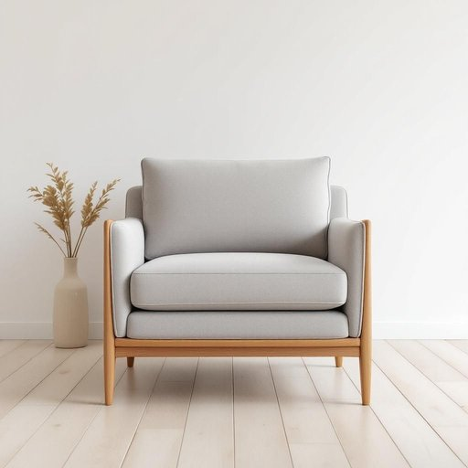

# settee

<h1 style="font-size: 2.5em; font-weight: 300; letter-spacing: 2px; margin: 0; color: #2c3e50;">
/settee*/
</h1>

---

---

## 例句

After moving the bulky settee, which had been in the living room for nearly a decade and was upholstered in faded floral fabric, we finally found enough space to install the new bookshelf that Mark had been assembling all weekend.

*After(/ˈæftər/) moving(/ˈmuvɪŋ/) the(/ðə/) bulky(/ˈbəlki/) settee,(/settee*,/) which(/wɪʧ/) had(/hæd/) been(/bɪn/) in(/ɪn/) the(/ðə/) living(/ˈlɪvɪŋ/) room(/rum/) for(/fər/) nearly(/ˈnɪrli/) a(/ə/) decade(/ˈdɛkeɪd/) and(/ənd/) was(/wɑz/) upholstered(/əˈpoʊlstərd/) in(/ɪn/) faded(/ˈfeɪdɪd/) floral(/ˈflɔrəl/) fabric,(/ˈfæbrɪk,/) we(/wi/) finally(/ˈfaɪnəli/) found(/faʊnd/) enough(/ɪˈnəf/) space(/speɪs/) to(/tɪ/) install(/ˌɪnˈstɔl/) the(/ðə/) new(/nu/) bookshelf(/ˈbʊkˌʃɛlf/) that(/ðət/) Mark(/mɑrk/) had(/hæd/) been(/bɪn/) assembling(/əˈsɛmbəlɪŋ/) all(/ɔl/) weekend.(/ˈwiˌkɪnd./)*

**翻译：** 在挪动那张已在客厅摆放近十年、覆盖着褪色花卉布料的笨重大沙发后，我们终于找到了足够的空间来安装马克整个周末一直在组装的新书架。

---

## 解释

英语单词“settee”作为名词在家居生活用品领域指一种带有软垫的长椅，通常有靠背和扶手，可以坐两人或多人，类似于“小沙发”或“长沙发椅”。这种家具多用于客厅、书房或玄关等休息等待的场所，既实用又具有装饰性，常见于英式传统家庭或复古风格的室内布置中。英语学习者在使用“settee”时应注意它是可数名词，复数形式为“settees”，通常与表示家具或坐具的动词搭配，如“sit on a settee”（坐在长沙发椅上）或“place a settee against the wall”（把长沙发椅靠墙放置）；此外，该词与“sofa”“couch”意义相近，但“settee”更具英国口语色彩且通常指较小或造型传统的座椅。词源上，“settee”源自印度英语，最初表示一种由藤条或木材制成的长椅，源自印度南部泰米尔语“sēdṭi”，意指“座位”，这一背景反映了殖民时代英语与印度地方语言的融合。中文语境中，“settee”常译为“长沙发椅”或“带靠背的长椅”，需区别于更现代或大型的“沙发”，准确理解其尺寸适中且多带传统风格的特点。该词在语气上通常中性，无明显褒贬含义，但在现代英语中使用较少，更偏向英国英语或文学描述，学习时注意区分其使用场合与现代家居术语的差异。

---

<small style="color: #999; font-size: 0.9em;">2025-07-27 09:14:04</small>

