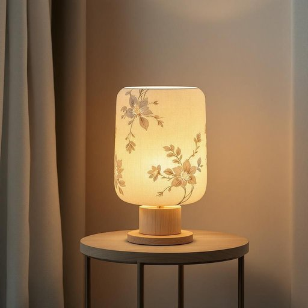

# shade

<h1 style="font-size: 2.5em; font-weight: 300; letter-spacing: 2px; margin: 0; color: #2c3e50;">
/ʃeɪd/
</h1>

---

---

## 例句

Could you please adjust the shade on the living room lamp, which has a delicate floral pattern and usually softens the light just enough to create a cosy atmosphere without making the room too dim?

*Could(/kʊd/) you(/ju/) please(/pliz/) adjust(/əˈʤəst/) the(/ðə/) shade(/ʃeɪd/) on(/ɔn/) the(/ðə/) living(/ˈlɪvɪŋ/) room(/rum/) lamp,(/læmp,/) which(/wɪʧ/) has(/həz/) a(/ə/) delicate(/ˈdɛləkət/) floral(/ˈflɔrəl/) pattern(/ˈpætərn/) and(/ənd/) usually(/ˈjuʒəwəli/) softens(/ˈsɔfənz/) the(/ðə/) light(/laɪt/) just(/ʤɪst/) enough(/ɪˈnəf/) to(/tɪ/) create(/kriˈeɪt/) a(/ə/) cosy(/ˈkoʊzi/) atmosphere(/ˈætməsˌfɪr/) without(/wɪˈθaʊt/) making(/ˈmeɪkɪŋ/) the(/ðə/) room(/rum/) too(/tu/) dim?(/dɪm?/)*

**翻译：** 请您帮忙调整一下客厅台灯的灯罩，那灯罩上带有精致的花卉图案，通常能够适度柔化光线，营造出温馨的氛围，同时又不会让房间显得过于昏暗。

---

## 解释

英语单词"shade"在家居生活用品场景中作为名词，主要指各种遮挡光线的物品，如灯罩（lamp shade）、窗帘遮阳布（window shade）或百叶窗的遮光部分，通常用于调节室内光线、保护隐私或装饰环境。具体使用场合多见于描述室内装修、照明配置或日常生活中调节光照的情境，比如说“This lamp has a blue shade”（这盏灯有一个蓝色的灯罩）或“Pull down the shade to block the sunlight”（拉下窗帘遮阳布以挡住阳光）。英语学习者在使用"shade"时应注意其不可数与可数用法，作为遮光物时通常为可数名词，如a lamp shade，一般与暗色、颜色变化搭配时也可表示色度差异，如“different shades of blue”（不同深浅的蓝色）。常见搭配包括“lamp shade”、“window shade”、“pull down the shade”等，此外，"shade"还可引申为轻微差别或阴凉处，但在家居用品语境中以遮光物品为主。词源上，"shade"源自古英语“sceadu”，意为阴影、阴凉，反映了其遮光、避免直射光的功能。中文中准确翻译为“灯罩”、“遮光物”或“遮阳布”，视具体语境而定，强调其调节光线和提供遮蔽的作用。该词在家居环境中通常无褒贬色彩，属中性词汇，文化内涵较为普通，纯粹功能性描述。

---

<small style="color: #999; font-size: 0.9em;">2025-07-27 09:14:04</small>

